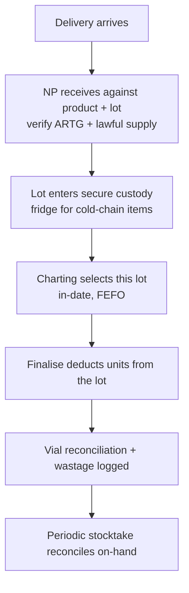
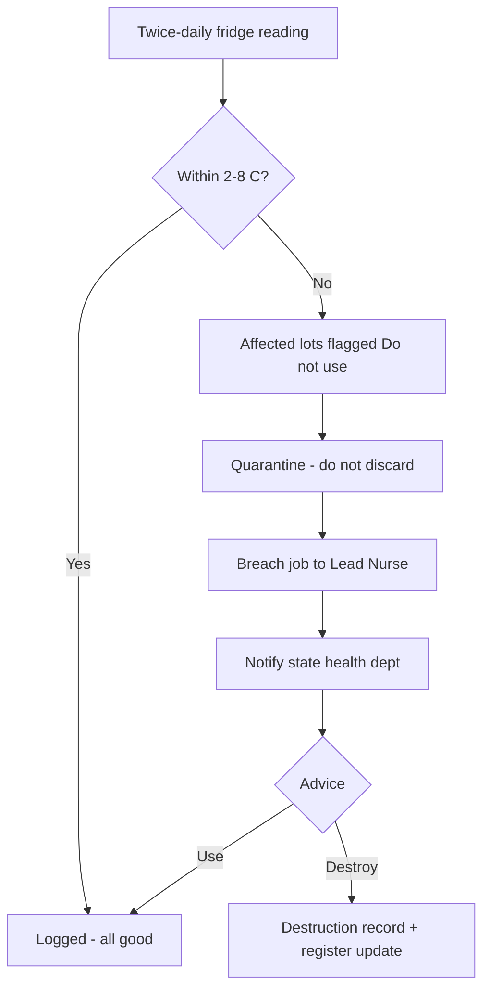
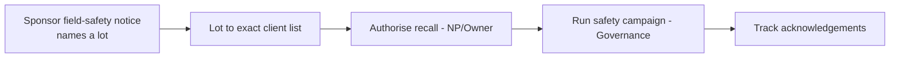

# Stock & medicines — overview

> The S4 medicines ledger and product catalogue: secure custody, batch-lot traceability, cold-chain,
> wastage and reconciliation — the evidence trail behind every treatment. Primary owners:
> **Nurse Practitioner** (custody + catalogue), **Lead Nurse** (day-to-day stock).

## What's in this area

| Function | What it does | When it's used | Primary role(s) |
|---|---|---|---|
| Product catalogue | Typed products (toxin/filler/skin/device) with unit, par, **S4 flag**, ARTG, modality class | Setup + maintenance | NP, Owner |
| Lots / batches | Per-product batches with expiry, on-hand, location, temperature | Receiving + dispensing | NP, Lead |
| Receive stock | Book in a delivery against a product + lot | On delivery | NP (custody) |
| Cold-chain | Per-lot temperature; twice-daily fridge log; excursion → quarantine | Daily | Lead, Reception |
| Wastage & reconciliation | Vial reconciliation, wastage log, stocktake | Per session / periodic | Lead, NP |
| Recall lookup | Lot → exact client list (instant) | On a recall | NP, Owner |
| Expiry / par alerts | FEFO use-first prompts; below-par signals | Continuous | Lead |

## Workflows

### 1 · Receive → custody → dispense → reconcile  — *NP / Lead*

### 2 · Cold-chain breach pathway  — *Reception logs, Lead acts*

### 3 · Recall from a lot  — *NP / Owner*

## Roles at a glance

| Role | Responsibilities in this area |
|---|---|
| **Nurse Practitioner** | S4 custody, receive stock, manage the catalogue + S4 flag, recall authorisation |
| **Lead Nurse** | Day-to-day stock, cold-chain integrity, wastage, par/expiry, stocktake |
| **Reception** | Logs fridge temps as part of open/close |
| **Owner** | Read-only oversight; sees stock-on-hand and expiry on the dashboard |

## Related

- Requirements: `REQ-MED-4/7/11/12/13/14/15`, compliance `C8/C11/C13/C15..C17`
- ADRs: **ADR-0021** (multi-product/unit catalogue), **ADR-0014** (S4 flag drives rewards/ads), **ADR-0008** (compliance by construction)
- PRDs: [PRD-04](../prds/PRD-04-consult-prescribing-s4.md)
