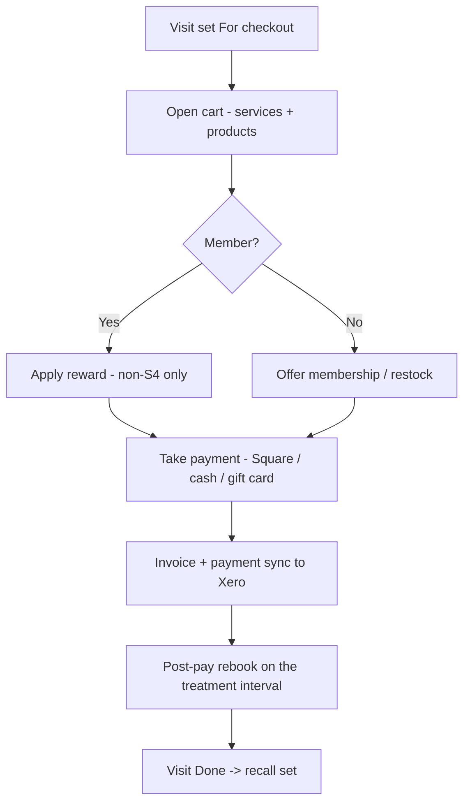
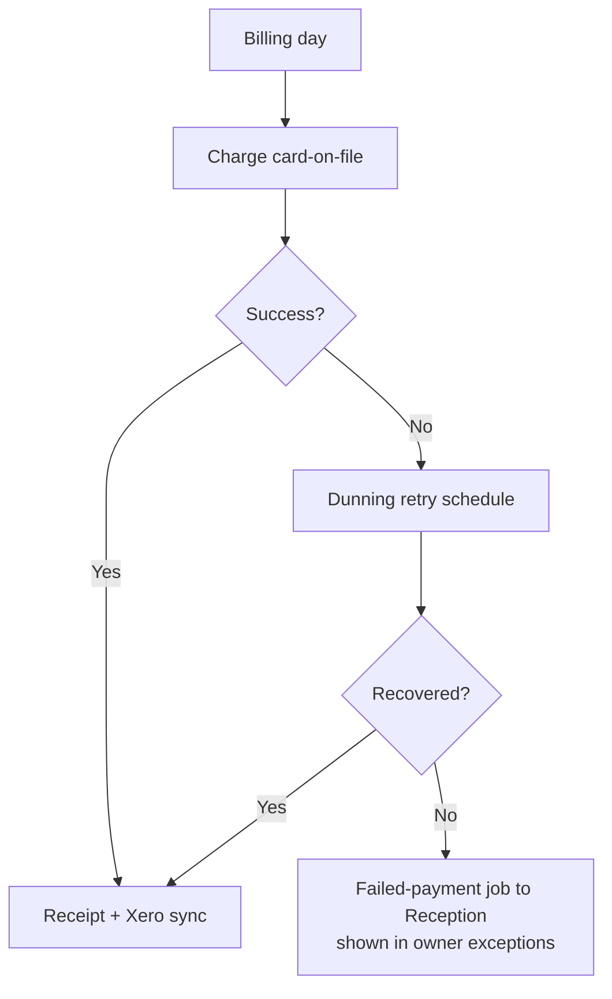
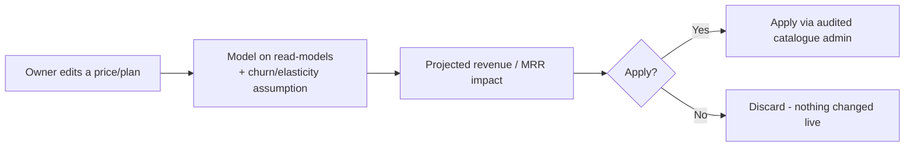

# Checkout, memberships & pricing — overview

> Taking payment in person, the membership/loyalty engine, and the owner's pricing planner. The books
> themselves live in **Xero** — this area is the point-of-sale and the commercial levers. Primary owners:
> **Reception** (POS), **Owner** (memberships & pricing).

## What's in this area

| Function | What it does | When it's used | Primary role(s) |
|---|---|---|---|
| Checkout / POS | In-person payment (Square card + cash + gift card); upsell cues; post-pay rebook | End of every visit | Reception |
| Rewards at checkout | Apply member rewards — **non-S4 only** | At payment | Reception |
| Memberships & packages | Plans, packages, autopay (card-on-file) + dunning retry | Sign-up + billing cycle | Reception, Owner |
| Loyalty & referrals | Points, referral credit — **non-S4 value only** | Ongoing | Reception, Owner |
| Gift cards | Issue + redeem | Ad hoc | Reception |
| Pricing & what-if | Model price/plan changes and the revenue/MRR impact before applying | Planning | Owner |

## Workflows

### 1 · Checkout & rebook  — *Reception*

### 2 · Membership autopay & dunning  — *system + Reception*

### 3 · Pricing what-if  — *Owner*

## Roles at a glance

| Role | Responsibilities in this area |
|---|---|
| **Reception** | Take payment, apply rewards, sell memberships/gift cards, rebook |
| **Owner** | Sets prices, plans & deals; runs what-if; sees MRR & dunning exceptions |
| **All staff** | Rewards/discounts are blocked on anything S4 by construction |

## Related

- Requirements: `REQ-PAY-6`, `REQ-MEMB-8/9/10`, compliance `C9/C23`
- ADRs: **ADR-0007** (payment provider), **ADR-0014** (S4 flag blocks rewards), **ADR-0022** (pricing what-if)
- PRDs: [PRD-06](../prds/PRD-06-payments-memberships-rewards.md)
