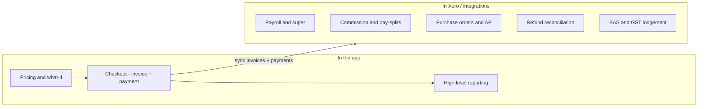
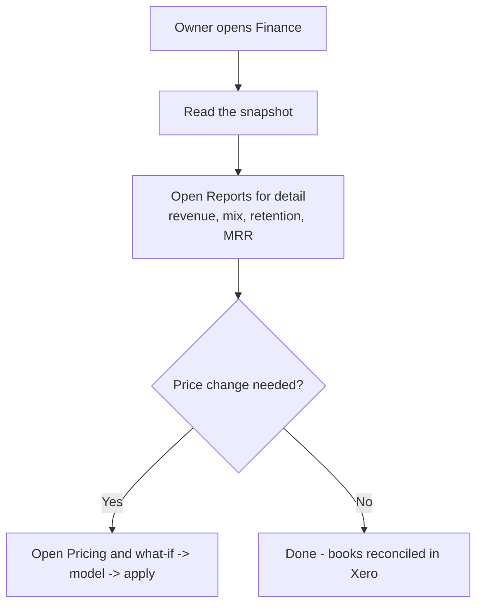

# Finance & reporting — overview

> Deliberately light. The clinic's books — payroll, accounts payable, commission, GST/BAS, reconciliation
> — live in **Xero and integrations**. The app keeps **pricing** and **high-level reporting**: the numbers
> that drive day-to-day decisions. Primary owner: **Owner**.

## What's in this area

| Function | What it does | When it's used | Primary role(s) |
|---|---|---|---|
| Finance snapshot | High-level takings (today / month / avg per visit / MRR) | Daily glance | Owner |
| Pricing & what-if | Set prices; model revenue/MRR impact (see Checkout overview) | Planning | Owner |
| Reports | Revenue, treatment mix, retention/churn, conversion, MRR, per-practitioner | Weekly/monthly | Owner |
| Xero sync | Invoices & payments flow from checkout to Xero | Continuous | system |
| **In Xero, not here** | Payroll & super, commission/pay-splits, supplier POs & AP, refunds reconciliation, BAS/GST | — | Bookkeeper / Owner |

## Workflows

### 1 · Where the money lives  — *app vs Xero*

### 2 · Monthly owner review  — *Owner*

## Roles at a glance

| Role | Responsibilities in this area |
|---|---|
| **Owner** | Reads the snapshot + reports, sets pricing, makes the commercial calls |
| **Bookkeeper / accountant** | Owns the ledger in Xero — payroll, AP, BAS, commission, reconciliation |
| **Reception** | Generates the source data at checkout (invoices/payments) |

## Related

- Requirements: `REQ-RPT-1..7` (narrowed to pricing + reporting), `REQ-INT-1` (Xero)
- ADRs: **ADR-0013** (read models), **ADR-0022** (pricing what-if), **ADR-0027** (money read models — *revised: books move to Xero*)
- PRDs: [PRD-08](../prds/PRD-08-reporting-compliance.md), [PRD-10](../prds/PRD-10-integrations.md)
