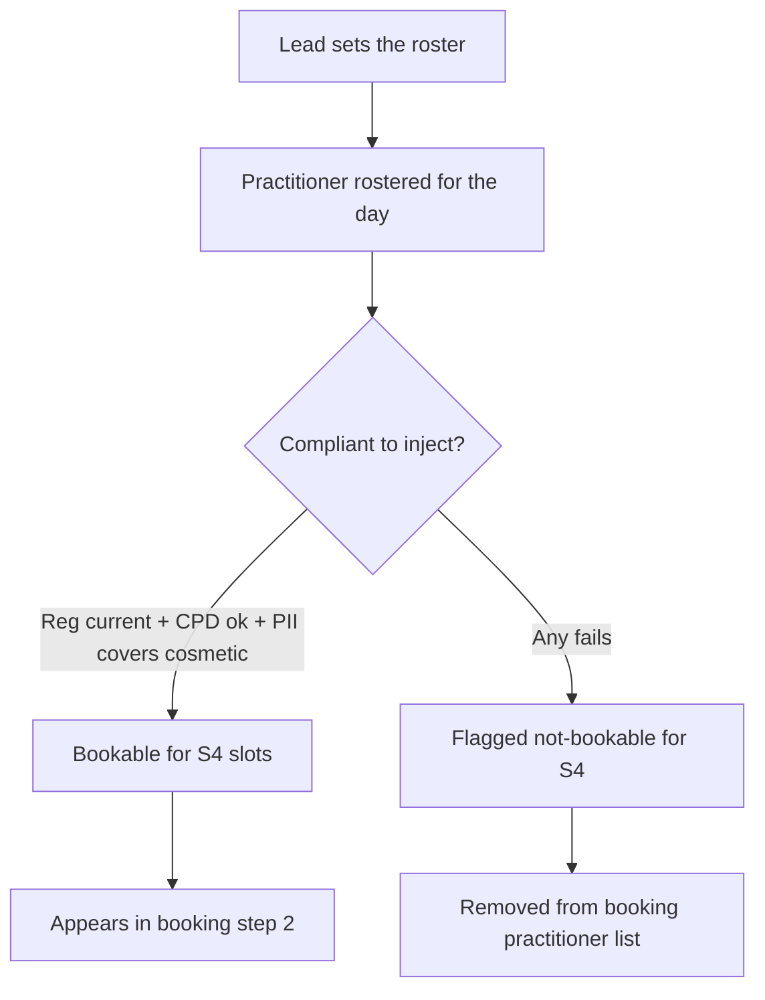
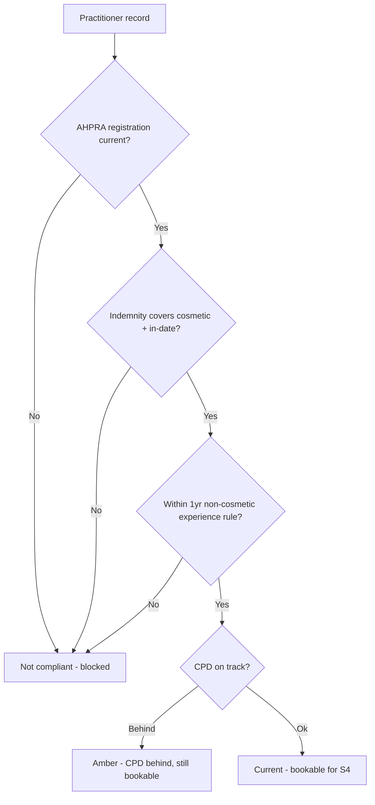
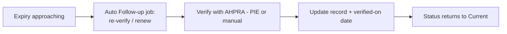

# Team & HR — overview

> Who works when, and whether they're legally clear to treat. The roster drives booking availability; a
> single compliance status (registration + CPD + cosmetic-cover insurance) decides who can be scheduled for
> S4 work. Primary owners: **Owner** and **Lead Nurse** (manage); everyone has a profile.

## What's in this area

| Function | What it does | When it's used | Primary role(s) |
|---|---|---|---|
| Roster & leave | Per-location shifts + leave; drives booking availability | Weekly planning | Owner, Lead |
| People & credentials | Per-practitioner profile: AHPRA reg, type, expiry, training | On hire + maintenance | Owner, Lead; self-view all |
| CPD records | Hours vs target (RN/EN 20h, NP 30h), 31-May cycle | Ongoing | Each practitioner |
| Indemnity insurance | Insurer, policy, expiry + **covers-cosmetic** flag | On hire + renewal | Owner, Lead |
| Compliance board | Derives `canInject`; flags not-bookable when reg/CPD/PII fail | Daily "can we open?" | Owner, Lead |
| Expiry tasks | Reg/CPD/PII expiries become Follow-up jobs | Continuous | Owner, Lead |

## Workflows

### 1 · Roster drives bookable practitioners  — *Lead/Owner → booking*

### 2 · Compliance status derivation (`canInject`)  — *system*

### 3 · Credential expiry handling  — *Owner/Lead*

## Roles at a glance

| Role | Responsibilities in this area |
|---|---|
| **Owner** | Manages people, engagement type, insurance; sees the compliance board + exceptions |
| **Lead Nurse** | Runs the roster, approves leave, monitors credential/CPD currency |
| **Each practitioner** | Logs own CPD, uploads own credential/PII evidence, views own profile |

## Related

- Requirements: `REQ-TEN-6..9`, compliance `C4/C19`
- ADRs: **ADR-0017** (capabilities × concerns), **ADR-0028** (credential/CPD/PII gating), **ADR-0029** (roster drives availability)
- PRDs: [PRD-01](../prds/PRD-01-foundations-tenancy.md), [PRD-02](../prds/PRD-02-booking-scheduling.md)
- Feasibility: **F13** (AHPRA PIE auto-verification — 🔬)
