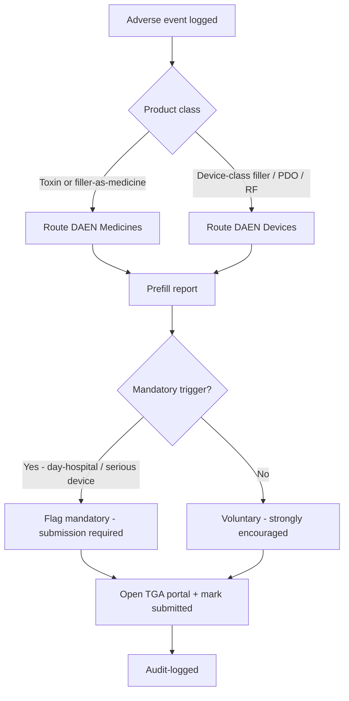
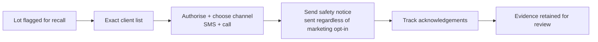
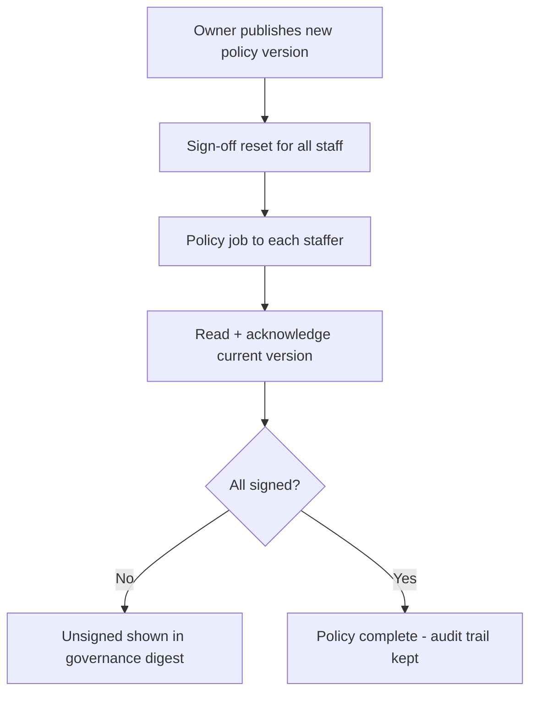
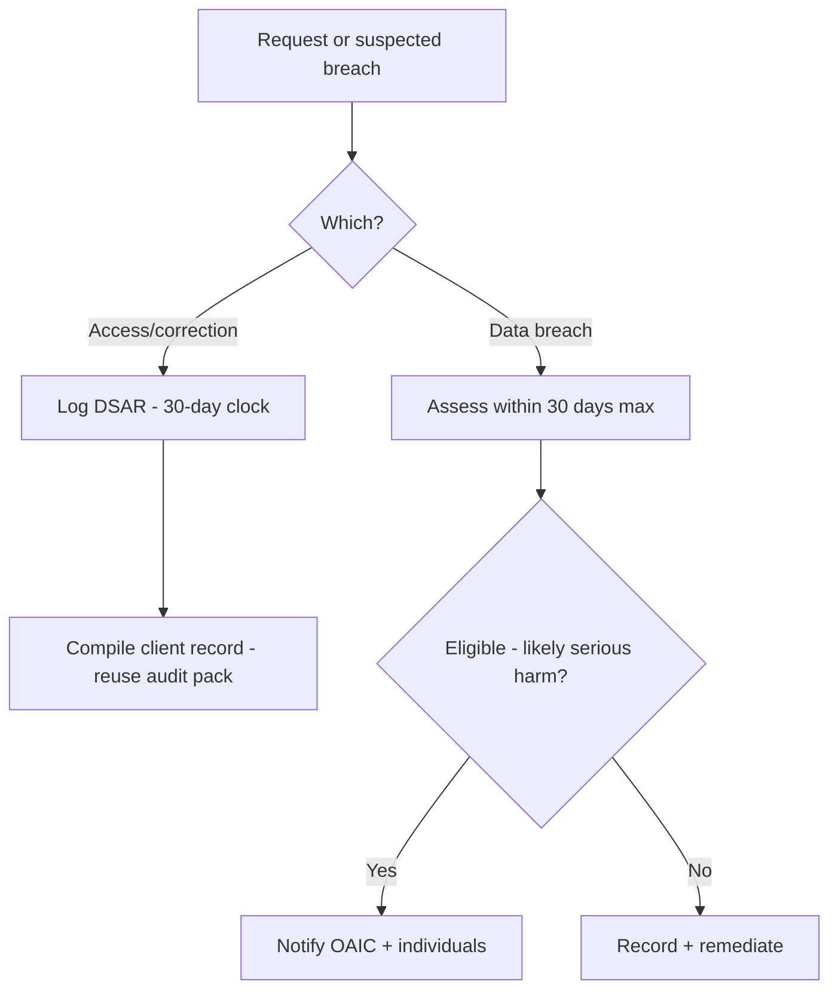

# Governance & compliance — overview

> The compliance officer's hub: a cross-case read/manage surface that keeps the per-treatment guardrails
> woven, but gives a home to the *execution and evidence* work — adverse-event reporting, recalls, policy
> sign-off, waste, privacy and audit packs. Primary owner: **Owner / compliance officer**, with **NP** and
> **Lead Nurse** contributing.

## What's in this area

| Function | What it does | When it's used | Primary role(s) |
|---|---|---|---|
| Overview digest | Open AE cases, unsigned policies, active recalls, accreditation countdown | Daily | Owner |
| Adverse events / DAEN | Routes medicine vs device; prefills + flags mandatory; portal hand-off | On an adverse event | NP, Owner |
| Recall execution | Lot → clients → safety campaign → acknowledgement tracking | On a recall | Owner, Reception |
| Policies & sign-off | Versioned P&P; staff read-and-acknowledge | On publish/revision | Owner publishes, all sign |
| Infection control & waste | IPC log + clinical/sharps waste manifests (NSW CA+TC / QLD WTC) | Per pickup | Lead |
| Privacy | DSAR (APP 12/13) with a 30-day clock; breach assess + drill | On request / incident | Owner |
| Audit / inspection pack | One-click dated evidence bundle | On inspection | Owner |

## Workflows

### 1 · Adverse event → DAEN routing  — *NP → Owner*

### 2 · Recall execution  — *Owner/NP authorise, Reception work*

### 3 · Policy publish → staff sign-off  — *Owner → all staff*

### 4 · Privacy: DSAR & breach  — *Owner*

## Roles at a glance

| Role | Responsibilities in this area |
|---|---|
| **Owner / compliance officer** | Owns the hub: AE submission tracking, recalls, policy publishing, audit packs, privacy |
| **Nurse Practitioner** | Clinical seriousness call on adverse events; authorises recalls |
| **Lead Nurse** | Infection-control log, waste manifests, emergency-kit currency |
| **All staff** | Sign policies; the per-treatment guardrails remain enforced in their normal flow |

## Related

- Requirements: `REQ-RPT-7`, `REQ-FAC-4..10`, `REQ-SEC-8/9`, `REQ-MED-12`, compliance `C8/C12/C16/C18/C20/C21/C22/C24`
- ADRs: **ADR-0030** (governance hub), **ADR-0031** (DAEN prefill + portal hand-off), **ADR-0008/0010** (compliance + audit)
- PRDs: [PRD-08](../prds/PRD-08-reporting-compliance.md), [PRD-11](../prds/PRD-11-facility-complaints.md), [PRD-04](../prds/PRD-04-consult-prescribing-s4.md)
- Feasibility: **F9/F15** (DAEN/ASDER + EPA submission APIs — 🔬)
