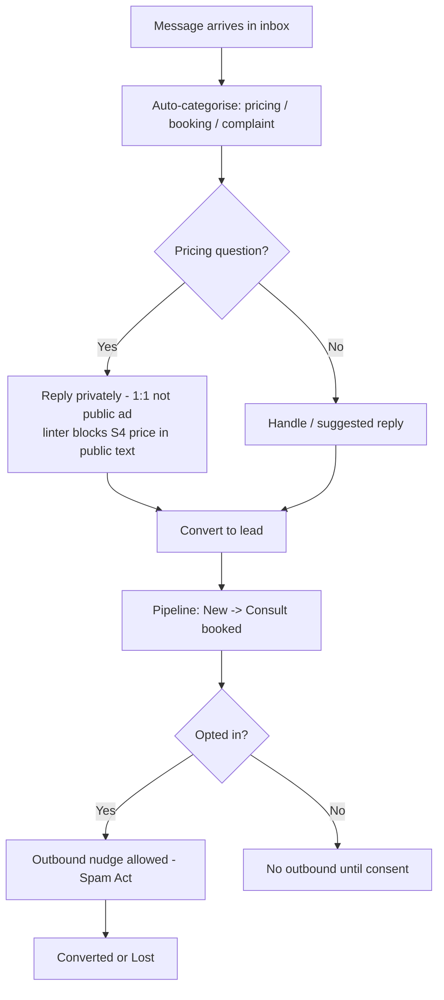
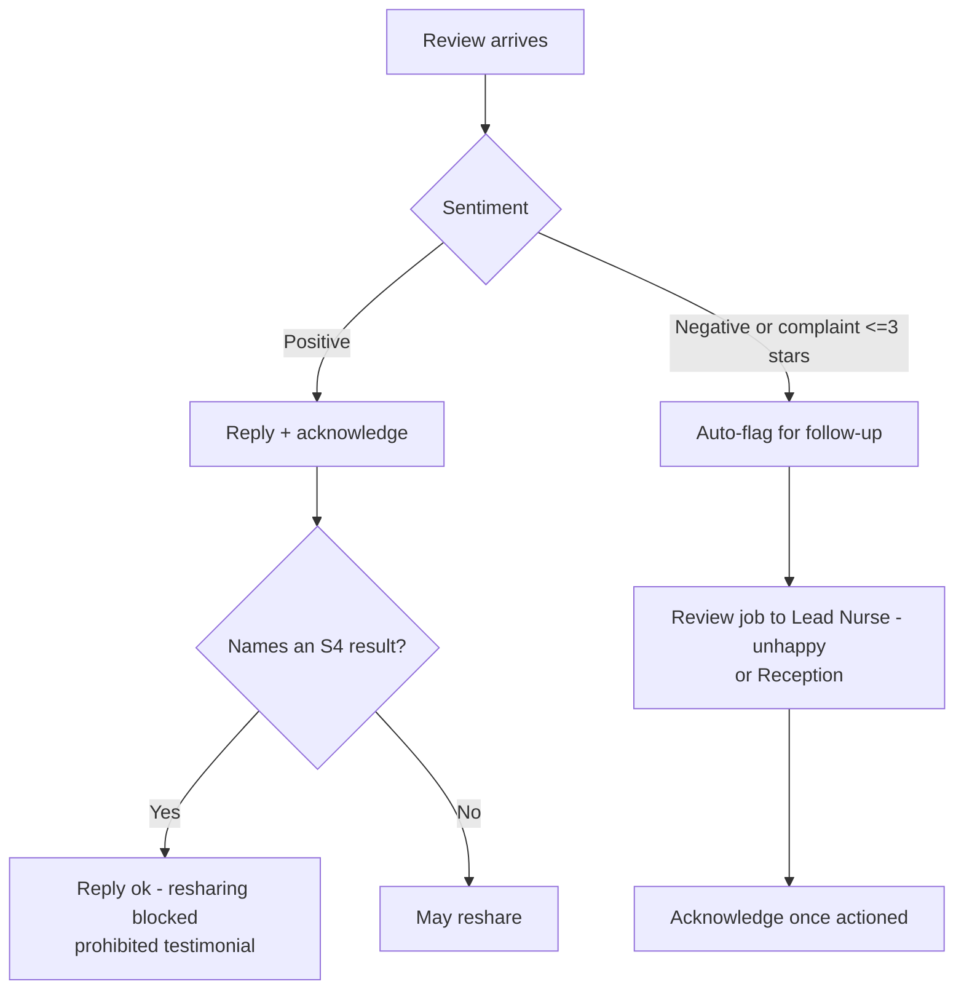
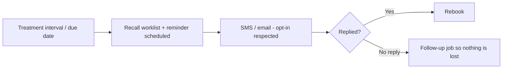
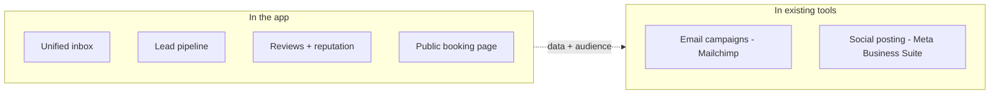

# Growth & communications — overview

> The clinic's front door for conversations and its growth engine — all under the advertising rules that
> forbid promoting an S4 product. The unified inbox, the lead pipeline, reviews, and reminders/recall.
> **Email campaigns and social posting are handled in the clinic's existing tools** (Mailchimp, Meta
> Business Suite), not rebuilt here. Primary owners: **Reception** (conversations/leads), **Owner** (growth).

## What's in this area

| Function | What it does | When it's used | Primary role(s) |
|---|---|---|---|
| Unified inbox | IG/FB/SMS/email in one list, categorised, client-linked, suggested replies | All day | Reception |
| Advertising linter | Blocks naming/pricing an S4 product on any public/outbound text | Every outbound | system + Reception |
| Lead / prospect CRM | Pipeline: enquiry → consult booked → converted/lost | On enquiries | Reception, Owner |
| Reviews / reputation | Request-all (no gating), reply, **acknowledge**, **flag / auto-detect** follow-up | Ongoing | Reception, Owner |
| Reminders & recall | Appointment reminders, aftercare, recall worklist | Scheduled | system, Reception |
| Public booking page | Generic service names, **S4 prices withheld** | Always-on | Owner (config) |
| Referrals | Non-S4 referral credit | Ongoing | Reception, Owner |

## Workflows

### 1 · Enquiry → lead → conversion  — *Reception*

### 2 · Reviews: reply, acknowledge, auto-detect follow-up  — *Reception/Lead*

### 3 · Reminders & recall comms  — *system → Reception*

## What is deliberately NOT in the app

## Roles at a glance

| Role | Responsibilities in this area |
|---|---|
| **Reception** | Works the inbox, converts leads, replies to reviews, runs reminders/recall comms |
| **Lead Nurse** | Handles flagged unhappy/clinical reviews + complaint callbacks |
| **Owner** | Growth oversight, conversion reporting, configures the public booking page & referrals |

## Related

- Requirements: `REQ-NOTIF-4/8/9/12`, `REQ-MEMB-10`, compliance `C9` (advertising), `C23` (consent)
- ADRs: **ADR-0018/0019** (omnichannel + identity), **ADR-0023** (jobs), **ADR-0032** (reviews — *extended: ack/flag/auto-detect*), **ADR-0033** (lead CRM), **ADR-0034** (one advertising linter — *revised: newsletter/social removed*)
- PRDs: [PRD-07](../prds/PRD-07-comms-reminders-recall.md)
- Feasibility: **F1** (Meta messaging — 🔬)
