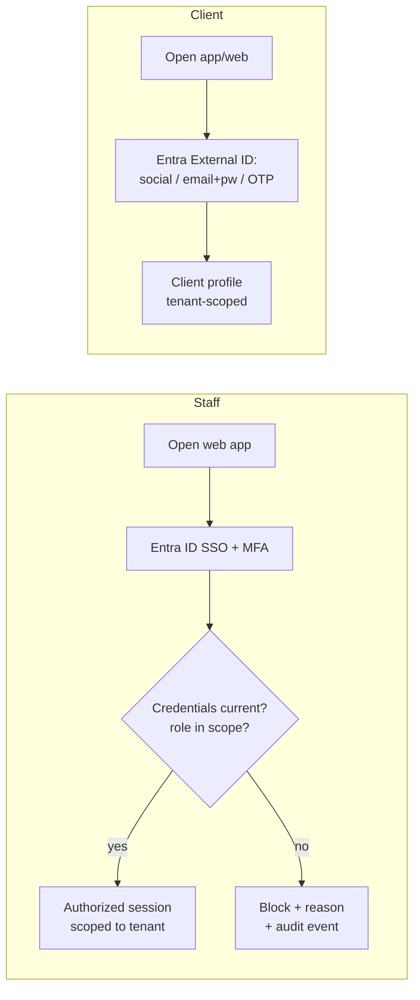

# PRD-01 — Foundations & Tenancy

> **Phase:** 0 · **Status:** Draft · **Owner:** —
> **Requirements:** REQ-TEN-1…4, REQ-SEC-1…7, REQ-CLI-3 · **Compliance:** C4, C10, C18, C19, C21, C22
> **ADRs:** 0001 (Azure), 0002 (Postgres), 0003 (RLS multi-tenancy), 0004 (Entra), 0005 (Angular/.NET), 0008 (compliance-by-construction), 0010 (audit/immutability), 0016 (residency)
> **Depends on:** — (unblocks everything)

## 1. Summary
The platform's backbone: a multi-tenant, AU-resident foundation with identity (staff SSO + client
CIAM), role/scope-of-practice authorisation, an append-only audit trail, retention/destruction and
data-breach handling, and the shared data model. Everything else builds on this.

## 2. Goals & non-goals
**Goals:** secure auth for staff (M365/Entra) and clients (social/email/OTP); tenant isolation via
RLS; configurable roles enforcing the §3 scope matrix; comprehensive audit; AU residency; retention
+ destruction register; breach workflow; patient access/correction.
**Non-goals (v1):** customer-facing SaaS onboarding/billing UI; per-tenant white-label theming;
SCIM provisioning; public API.

## 3. Users
Clinic owner/manager, front-desk/admin, RN, NP/prescriber, dermal therapist, remote prescriber, client.

## 4. User stories
- As an **owner**, I provision my clinic (tenant) and invite staff so they can sign in with our existing **Microsoft 365** accounts.
- As **staff**, I sign in via **Entra ID SSO + MFA**; my role and AHPRA credentials determine what I can do.
- As a **client**, I create an account with **Google/Apple, email+password, or email/SMS OTP**.
- As an **owner**, I configure roles/permissions and see that the system **blocks** actions outside a user's scope or when their registration has lapsed.
- As a **compliance officer**, I export an **audit trail** of who viewed/changed clinical, medicines and PII data.
- As a **client**, I can **access and request correction** of my own personal/health information.
- As an **admin**, retention timers and a **destruction register** manage records per legal periods, and a **breach workflow** guides notification.

## 5. Key flows

## 6. Functional scope
- **Tenancy** (REQ-TEN-1, ADR-0003): every row carries `tenant_id`; RLS enforces isolation; API sets tenant context per request.
- **Identity** (REQ-TEN-2, ADR-0004): staff Entra ID SSO+MFA; client Entra External ID (social/local/OTP). Per-tenant Entra federation supported for SaaS.
- **RBAC + scope-of-practice** (REQ-TEN-3/4, C4/C19): roles map to the §3 matrix; staff profiles hold AHPRA reg #, type, status/expiry, conditions, ≥1yr-experience flag, training; the auth pipeline blocks out-of-scope or lapsed-registration actions and alerts before expiry.
- **Audit** (REQ-SEC-3, C10, ADR-0010): append-only `AuditEvent` for all PHI/clinical/medicines read+write; exportable.
- **Security/residency** (REQ-SEC-1/2/6, C10/C21, ADR-0016): AU East; encryption in transit + at rest; least-privilege; signed-URL media; cross-border sub-processor controls.
- **Retention & destruction** (REQ-SEC-4, C18): retention policy engine (adults ≥7y from last contact; minors to age 25; indefinite on complaint/litigation), destruction register + certificates, transfer log.
- **Privacy rights** (REQ-SEC-5, C21): collection notice + consent at sign-up; patient access & correction (APP 12/13).
- **Breach** (REQ-SEC-7, C22): detect/assess eligible breaches; OAIC + individual notification; breach register.
- **Client DOB/age** (REQ-CLI-3): capture DOB, derive under-18 flag (feeds C6/C9 elsewhere).

## 7. Data & entities
`Tenant`, `Location`, `StaffProfile` (role, AHPRA credentials, scope), `Role`/`Permission`,
`Client` (DOB, flags), `AuditEvent` (append-only), `RetentionPolicy`/`DestructionRecord`,
`DataBreach`, `ConsentToCollect`/`PrivacyNotice`. (See §7 of requirements for the full model.)

## 8. Acceptance criteria
- **AC1 (C4/C19):** Given an RN without the ≥1yr-experience flag *or* with lapsed registration, when they attempt an in-scope clinical action, the system **blocks** it and records an audit event with the reason.
- **AC2 (tenancy):** Given a user in Tenant A, when they query any record, RLS returns **only** Tenant-A rows; a cross-tenant id returns not-found.
- **AC3 (auth):** Staff can complete Entra SSO+MFA; clients can register via each of social, email+password, and OTP.
- **AC4 (C10):** Every read/write of clinical/medicines/PII produces an immutable `AuditEvent` (who, what, when, tenant); the log is exportable.
- **AC5 (C18):** A record past its retention period surfaces for destruction; destroying it writes a destruction-register entry (patient, period, date) and a certificate reference.
- **AC6 (C21):** A client can view their own data and submit a correction request that is tracked to resolution.
- **AC7 (C22):** Flagging a breach starts an assessment workflow and, if eligible, produces OAIC + individual notifications and a breach-register entry.
- **AC8 (residency):** All PII/PHI storage + compute resolve to Australia East; a sub-processor outside AU is blocked unless an APP-8 assessment + consent record exists.

## 9. Dependencies & sequencing
Foundational — build first. Spikes: Entra External ID ↔ Flutter ↔ .NET auth; Postgres RLS with EF Core session context.

## 10. Out of scope (this PRD)
Domain features (booking, clinical, payments…) — their own PRDs. SaaS onboarding/billing UI (Phase 3).

## 11. Open questions
- Postgres vs Azure SQL final pick (ADR-0002, §10.7).
- MFA policy for clients (optional vs required for sensitive actions).
