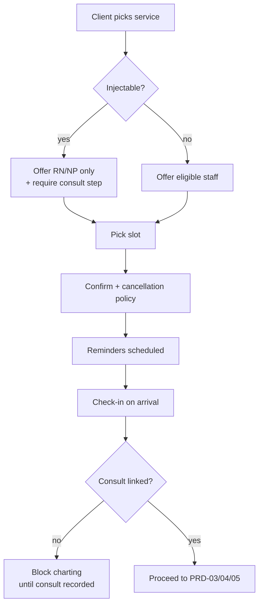

# PRD-02 — Booking & Scheduling (+ client/CRM basics)

> **▸ Prototype alignment (rev 2, 2026-06-19).** Adds **REQ-BOOK-6**: **reschedule (move) & cancel** on the calendar, **VIP / first-time** appointment tags, **per-day & per-treatment-type counts** + utilisation/**quiet-window fill** suggestions, and an **"in-room now"** indicator with quick chart/profile links. The booking wizard (service → practitioner → time → client → confirm, **RN/NP-only for injectables**) is validated by the prototype. Adds the **visit lifecycle** (status state-machine + role hand-offs), **late & no-show** flags (no-show → a follow-up call) and **new-vs-returning / reason / roster** in booking (**REQ-BOOK-7**, ADR-0024). See [requirements §12](../02-requirements.md#12-prototype-alignment--feasibility-register).
>
> **▸ Prototype alignment (rev 4, 2026-06-20).** Adds **walk-ins & same-day add-ons** (gate-respecting — an injectable walk-in still needs a consult first), **waitlist auto-fill** on cancel/no-show, **room/chair/device resources** with conflict-flagging & utilisation, and an **opt-in, ACL-fair booking deposit / card-on-file hold** that is **suppressed during cooling-off** (F14 invariant). Booking availability is now derived from **roster ∩ credential/PII compliance** (ADR-0026/0029, REQ-BOOK-3/8/9/10).

> **Phase:** 1 · **Status:** Draft 
> **Requirements:** REQ-BOOK-1…5, REQ-CLI-1/2/3 · **Compliance:** C4 (scope gating), C6 (under-18 flag feed) 
> **ADRs:** 0005, 0008 · **Depends on:** PRD-01

## 1. Summary
Booking and the calendar that runs the front desk, plus the 360° client record everything hangs
off. Bookings are **scope-aware** (only RN/NP can be booked for injectables) and an injectable
booking is **gated** so it can't proceed to charting without a consult.

## 2. Goals & non-goals
**Goals:** multi-resource calendar (practitioner + room); online self-booking (web + client app);
reminders + self-service reschedule/cancel; waitlist; cancellation policy (no deposits in v1); a
searchable client directory with the full profile.

**Non-goals (v1):** deposits/card-on-file holds; marketplace listing; group/class scheduling;
device/laser resource scheduling; multi-location switching UI.

## 3. Users
Client (self-book), front-desk/admin, practitioners (own calendar), owner.

## 4. User stories
- As a **client**, I book a toxin consult/treatment online, choosing service → practitioner → time, and get SMS/app reminders.
- As a **client**, I reschedule or cancel within policy without calling.
- As **front desk**, I see a day view of practitioners + rooms, drag to rebook, and manage a waitlist that backfills cancellations.
- As the **system**, I only offer **RN/NP** for injectable services (scope-aware), and flag **under-18** bookings for cooling-off handling downstream.
- As **any staff**, I open a client's **360° profile** (history, contacts, medical flags, consents, photos, memberships, balances).

## 5. Key flow

## 6. Functional scope
- **Calendar** (REQ-BOOK-1): resources = practitioner + room; service durations with buffer/processing/turnaround; day/week/room views; time-off & rosters.
- **Online booking** (REQ-BOOK-2): service→practitioner→slot; **scope-aware** availability (injectables → RN/NP only, per C4); public service names follow advertising rules (C9 — see PRD-07/§10.6).
- **Policy** (REQ-BOOK-3): configurable cancellation/no-show policy; **no deposit/card-on-file in v1**.
- **Lifecycle** (REQ-BOOK-4): reminders (SMS/app/email) with confirm/decline; self-service reschedule/cancel; waitlist + cancellation backfill; check-in.
- **Consult gate** (REQ-BOOK-5): an injectable appointment cannot move to charting without a linked `Consult` (handoff to PRD-04).
- **Client/CRM** (REQ-CLI-1/2/3): 360° profile; search/filter; duplicate merge; soft-delete with audit; DOB + under-18 flag.

## 7. Data & entities
`Appointment` (status, resources, policy), `Service`/`TreatmentType` (+`schedule` S4|non-S4, duration, eligible roles), `Room`, `StaffAvailability`/`TimeOff`, `Waitlist`, `Client` (profile), `CommsLogEntry`.

## 8. Acceptance criteria
- **AC1 (C4):** An injectable service offers only RN/NP-credentialled practitioners; other staff never appear as bookable for it.
- **AC2 (REQ-BOOK-5):** A checked-in injectable appointment with **no** linked consult cannot open the charting screen; the UI explains why.
- **AC3:** A client can self-reschedule/cancel within policy; outside policy the configured rule applies (no auto-charge in v1).
- **AC4:** Cancelling a slot offers it to the waitlist.
- **AC5 (C6 feed):** A booking for a client under 18 is flagged so PRD-03 can enforce cooling-off.
- **AC6:** Reminders fire per template; confirm/decline updates appointment status.

## 9. Dependencies & sequencing
After PRD-01. Feeds PRD-03 (intake/consent sent on booking) and PRD-04/05 (consult/charting gate). Reminder channel from PRD-07.

## 10. Out of scope
Deposits/holds, marketplace, classes, device scheduling (Phase 2).

## 11. Open questions
- Default cancellation window/policy values.
- Public booking-page service naming (generic) — confirm presentation (§10.6).
