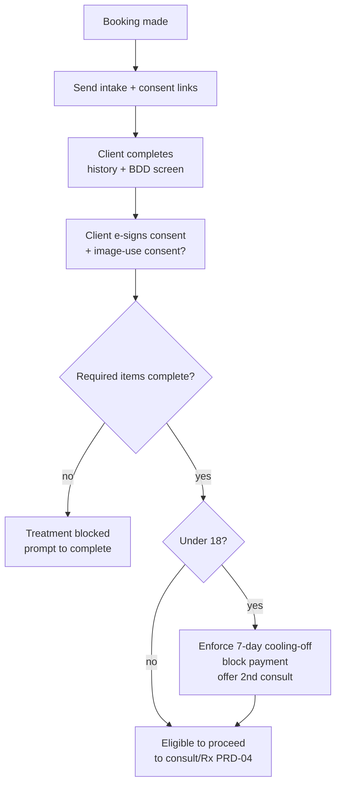

# PRD-03 — Intake, Consent & Compliance Gating

> **Phase:** 1 · **Status:** Draft
> **Requirements:** REQ-CONS-1…5, REQ-CLI-3 · **Compliance:** C3, C5, C6, C14, C18
> **ADRs:** 0008 (compliance-by-construction) · **Depends on:** PRD-01, PRD-02

## 1. Summary
Turns AHPRA's patient-safety rules into enforced workflow: pre-visit intake (medical history,
contraindications, **BDD/psychological screen**), versioned **e-signed consent** with mandated
content, **separate image-use consent**, and **cooling-off** + payment blocks for under-18s.
Treatment is **blocked** until required intake/consent is complete.

## 2. Goals & non-goals
**Goals:** digital pre-visit intake on the client app; versioned consent meeting AHPRA content;
image-use consent (separate, withdrawable); BDD screen; cooling-off enforcement; treatment gating.
**Non-goals (v1):** third-party e-sign integration (built-in is enough); paper-scan fallback;
per-treatment consent library beyond toxin (templated, extensible).

## 3. Users
Client (completes intake/consent), RN/NP (reviews assessment, BDD flag), front desk (sends/checks).

## 4. User stories
- As a **client**, before my visit I complete intake (history, meds, allergies, contraindications) and a **screening questionnaire** on my phone.
- As a **client**, I read plain-language consent covering the procedure, **risks/benefits/alternatives, the practitioner's qualifications and costs**, and I e-sign it; I give **separate** consent for any photo use and can **withdraw** it later.
- As an **RN/NP**, I see a **BDD/psychological** flag and the completed assessment before proceeding, and I can't start treatment if required consent/intake is missing.
- As the **system**, for an **under-18** I enforce a **7-day cooling-off** and **block payment** (except the consult) until it elapses, and I offer/record a **second consultation**.

## 5. Key flow

## 6. Functional scope
- **Intake** (REQ-CONS-2/3): configurable pre-visit forms; medical history, meds, **allergies/contraindications**; **BDD/psychological screening** instrument that flags for prescriber review; auto-linked to chart.
- **Consent** (REQ-CONS-1, C5/C18): versioned, e-signed, verbal+written, plain-language; mandated content (nature, risks/benefits/alternatives, **practitioner qualifications, costs**, realistic-outcome language, complaint mechanisms incl. AHPRA-despite-NDA). Versions retained.
- **Image-use consent** (REQ-CONS-5, C14): **separate**, scoped, **withdrawable any time** (stops downstream use); media never on personal devices (enforced in PRD-05/ADR-0009).
- **Cooling-off** (REQ-CONS-4, C6): under-18 ≥7 days between consent and procedure + **payment block** (except consult); configurable cooling-off + recorded **second consultation** option for all patients.
- **Gating** (ADR-0008): treatment cannot start unless required intake + consent are complete and current (server-enforced).

## 7. Data & entities
`IntakeForm`/`IntakeResponse`, `ScreeningResult` (BDD), `ConsentTemplate`(version)/`ConsentSignature`,
`ImageConsent` (scope, granted/withdrawn), `CoolingOffTimer`. Links to `Client`, `Appointment`, `Consult`, `ChartEntry`.

## 8. Acceptance criteria
- **AC1 (C5):** Treatment is blocked until a **current, version-matched** consent with all mandated content is e-signed; the block states what's missing.
- **AC2 (C3):** A completed **BDD/psychological** screen authored by an RN/NP is present before treatment; a positive flag is surfaced to the prescriber.
- **AC3 (C6):** For an under-18, the system enforces ≥7 days between consent and procedure and **blocks payment** (except the consult) until elapsed; a second-consultation offer is recorded.
- **AC4 (C14):** Image use requires a **separate** consent; withdrawing it immediately stops further use and is audited.
- **AC5 (C18):** Consent versions and intake responses are retained per the retention policy.
- **AC6:** Changing a consent template creates a new **version**; previously signed consents remain bound to the version signed.

## 9. Dependencies & sequencing
After PRD-01/02. Hard prerequisite for PRD-04 (consult/Rx) and PRD-05 (charting). Payment block coordinates with PRD-06.

## 10. Out of scope
Non-toxin consent libraries beyond a templated/extensible base; external e-sign vendor.

## 11. Open questions
- Which validated **BDD screening instrument** to embed.
- Adult cooling-off default (off / configurable N days) pending legal read (§10 open item).
