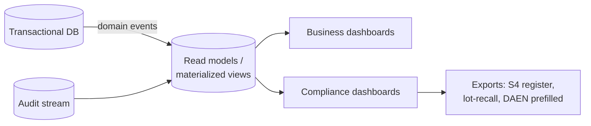

# PRD-08 — Reporting & Compliance Dashboards

> **▸ Prototype alignment (rev 2, 2026-06-19).** The prototype's **reports dashboard** (revenue trend, **treatment mix**, top treatments, new-vs-returning, retention, membership MRR) validates REQ-RPT-1. The same read models back the owner **pricing what-if** planner (ADR-0022 / REQ-MEMB-9). Compliance dashboards are unchanged. Adds an owner **"needs attention" exceptions digest** (**REQ-RPT-5**). See [requirements §12](../02-requirements.md#12-prototype-alignment--feasibility-register).

> **▸ Prototype alignment (rev 4, 2026-06-20).** Reporting & compliance become a first-class **Governance hub** (ADR-0030) — a cross-case read/manage surface that keeps the per-treatment guardrails woven: **AE/DAEN routing + prefilled submission** (medicine vs device; mandatory-trigger flag — ADR-0031), **recall execution + acknowledgement tracking**, **policies & procedures sign-off**, **clinical/sharps waste manifests + IPC log**, **DSAR (APP 12/13) + breach drill** (REQ-SEC-8/9), and a one-click **inspection-readiness pack** (REQ-RPT-7). Adds **money read models** — commission/pay-run (engagement-risk flag), retail margin, refunds/disputes and a **BAS/GST summary** (REQ-RPT-6) — *attribution & export, not a payroll/tax engine*.

> **Phase:** 1 · **Status:** Draft 
> **Requirements:** REQ-RPT-1…4 · **Compliance:** C10 + evidences C1–C24 
> **ADRs:** 0013 (read models), 0010 (audit) · **Depends on:** PRD-01 (audit), data from PRD-02/04/05/06

## 1. Summary
Turns the platform's data into the business intelligence the clinic already relies on (rebuilding
the prototyped analytics on live data) **and** the audit-ready compliance evidence that makes the
moat real — consent coverage, S4 register, lot recall, registration/retention watch, breach &
complaints registers. Fixes the "reporting gaps" Mindbody pain.

## 2. Goals & non-goals
**Goals:** operational + financial + retention dashboards with date filters; per-practitioner views;
compliance dashboards + exports; the TGA **DAEN adverse-event** prefilled export; data-quality checks.

**Non-goals (v1):** custom report builder; external BI warehouse; benchmarking against other clinics.

## 3. Users
Owner/manager (business + compliance), prescriber/owner (medicines register), compliance officer (audits).

## 4. User stories
- As an **owner**, I see **revenue, retention/churn, no-shows, cancellations, conversion, at-risk, big spenders, membership MRR/churn**, filterable by date, and **per-practitioner**.
- As a **compliance officer**, I see **consent coverage**, **consult-before-script adherence**, and export the **S4 medicine register**.
- As a **prescriber**, I run a **lot → clients** recall lookup instantly.
- As an **owner**, I watch **practitioner registration expiry**, **records due for retention/destruction**, **S4 stock discrepancies**, and the **breach & complaints registers**.
- As a **prescriber**, I generate a **prefilled DAEN** adverse-event report.

## 5. Key flow

## 6. Functional scope
- **Business analytics** (REQ-RPT-1): revenue (service/product/membership), retention/churn, no-shows, cancellations, conversion funnel, at-risk, big spenders, membership MRR/churn, per-practitioner mix; reward-cost vs retention (from PRD-06).
- **Filtering** (REQ-RPT-2): date-range presets + custom; parity with the prototype tool.
- **Compliance dashboards** (REQ-RPT-3, C-coverage): consent coverage; consult-before-script adherence (C1); **S4 register export** (C8); **lot→clients recall** (C8); cooling-off adherence (C6); **registration-expiry watch** (C19); **records-retention/destruction due** (C18); **S4 stock discrepancies** (C17); **breach** (C22) & **complaints** (C24) registers.
- **Adverse-event / DAEN** (C12): classify seriousness, route medicine vs device, produce a **prefilled export/submission**; flag mandatory cases.
- **Data quality** (REQ-RPT-4): carry over anomaly checks (active-but-unseen, completed-not-checked-in, duplicates, missing contacts, implausible dates).
- **Architecture** (ADR-0013): dedicated read models/materialized views; eventual consistency acceptable.

## 7. Data & entities
`ReportingView`/materialized views, `ComplianceMetric`, `RegisterExport`, `DaenReport`, `DataQualityFinding`. Reads from domain + `AuditEvent`.

## 8. Acceptance criteria
- **AC1 (C8):** The S4 register exports a complete, immutable record of administrations; a lot lookup returns all affected clients.
- **AC2 (C1):** Consult-before-script adherence shows 100% by construction; any exception is impossible to create (cross-checks PRD-04 invariants) and otherwise flagged.
- **AC3 (C19):** Practitioners within N days of registration expiry appear on a watchlist.
- **AC4 (C18):** Records due for destruction are listed with their retention basis.
- **AC5 (C12):** An adverse event produces a prefilled DAEN report targeting the correct database with seriousness set.
- **AC6 (business):** Core dashboards match the prototype's metrics on the same date range.
- **AC7 (perf, ADR-0013):** Dashboards read from materialized views, not OLTP, and load within target on clinic data volumes.

## 9. Dependencies & sequencing
After PRD-01 (audit) and once PRD-02/04/05/06 emit data. Build read models incrementally as modules land.

## 10. Out of scope
Custom report builder, external warehouse, cross-clinic benchmarking (Phase 2+).

## 11. Open questions
- Which prototype dashboards are must-have for v1 vs fast-follow.
- DAEN submission: export/file vs any available electronic channel.
