# PRD-09 — Apps (Flutter): Client & Provider

> **▸ Option A alignment (rev 2, 2026-06-19).** The prototype is a **responsive web** back-office (phone on-the-go + tablet in-room) plus **client-portal** screens — it validates the layouts and flows the **Flutter** client & provider apps will implement (REQ-APP-1/2): role-tailored views, charting, checkout and the conversation inbox. See [requirements §12](../02-requirements.md#12-option-a-prototype-alignment--feasibility-register).

> **Phase:** 1 · **Status:** Draft
> **Requirements:** REQ-APP-1…3 (surfaces features from PRD-02…07) · **Compliance:** C14 (media), C21 (privacy)
> **ADRs:** 0006 (Flutter), 0009 (media/signed URLs), 0015 (offline sync), 0004 (auth)
> **Depends on:** PRD-01 (auth/API); surfaces PRD-02/03/05/06/07

## 1. Summary
Two Flutter apps over the shared .NET API: a **client app** (book, intake/consent, photos,
memberships, rewards, balances) and a **provider app** (room-side charting, injection mapping,
camera capture, consult/Rx, finalise) — the latter resilient to treatment-room connectivity.

## 2. Goals & non-goals
**Goals:** one Flutter codebase, two flavours; shared design system + API client + auth; native
camera; offline-tolerant provider workflows; client self-service.
**Non-goals (v1):** customer online checkout (payments are in-person; app captures membership
card-on-file only); native POS hardware; AI features; tablet kiosk mode.

## 3. Users
Client (own device), injector/prescriber (provider app on phone/tablet), front desk (web primarily).

## 4. User stories
**Client app**
- Book/reschedule; complete **intake + consent** and **image-use consent**; view **before/after photos** (consented); see **memberships, rewards/perks, balances**; add a **card-on-file** for membership autopay; receive reminders/recall.

**Provider app**
- See my day; open a patient (consult + consent verified); **map injections** and **capture photos** room-side; record consult / link script; **finalise** the chart; **log adverse events** — all working even if Wi-Fi drops, syncing later.

## 5. Key flow

```mermaid
flowchart TD
  subgraph Client app
    CA1[Sign in: social/email/OTP] --> CA2[Book + complete intake/consent]
    CA2 --> CA3[View photos / membership / rewards / balance]
    CA3 --> CA4[Add card-on-file for autopay]
  end
  subgraph Provider app
    PA1[Sign in: Entra SSO] --> PA2[Day schedule]
    PA2 --> PA3[Open patient → verify consult+consent]
    PA3 --> PA4[Map injections + capture photos]
    PA4 --> PA5{Online?}
    PA5 -- no --> PA6[Encrypted local queue]
    PA6 --> PA7[Sync]
    PA5 -- yes --> PA8[Save draft]
    PA7 --> PA8
    PA8 --> PA9[Finalise → immutable]
  end
```

## 6. Functional scope
- **Shared** (ADR-0006): Flutter codebase; packages for auth (Entra ID staff / Entra External ID clients, ADR-0004), API client (OpenAPI), design system. Store distribution + code-push (e.g. Shorebird) where feasible.
- **Client app** (REQ-APP-1): surfaces PRD-02 booking, PRD-03 intake/consent, PRD-05 photo viewing (consent-gated), PRD-06 memberships/rewards/balances + card-on-file capture, PRD-07 reminders/recall.
- **Provider app** (REQ-APP-2): surfaces PRD-05 charting/mapping + camera, PRD-04 consult/Rx/administration; **offline queue + sync** (ADR-0015); media via signed URLs, never persisted on device beyond transient cache (ADR-0009, C14).
- **Sync/integrity** (REQ-APP-3, ADR-0015/0010): drafts last-write-wins; finalisation server-side + immutable.

## 7. Data & entities
Client-side: encrypted local queue/cache (drafts, pending photos), auth tokens (secure storage). Server entities reused from other PRDs via the API.

## 8. Acceptance criteria
- **AC1 (auth):** Client app supports social/email/OTP sign-in; provider app uses Entra SSO; both scoped to tenant.
- **AC2 (C14/ADR-0009):** Provider app captures photos to central storage via signed URLs; no photo persists on the device after sync; capture requires image-use consent.
- **AC3 (ADR-0015):** With connectivity lost mid-visit, charting/photos queue locally (encrypted) and sync on reconnect with no data loss.
- **AC4 (REQ-APP-1):** A client can complete the full pre-visit journey (book → intake → consent) entirely in-app.
- **AC5:** Membership card-on-file can be added in-app (feeds PRD-06 autopay); no one-off online checkout is exposed.
- **AC6 (immutability):** Finalisation happens server-side; once finalised the app shows the entry read-only.

## 9. Dependencies & sequencing
After PRD-01 and the feature modules it surfaces. Build the **injection-mapping canvas** and **offline sync** as early spikes (highest app risk).

## 10. Out of scope
Online checkout, native POS hardware, AI, kiosk mode (Phase 2+).

## 11. Open questions
- Code-push tool (Shorebird) viability for the compliance posture.
- Tablet vs phone primary form factor for the provider app.
