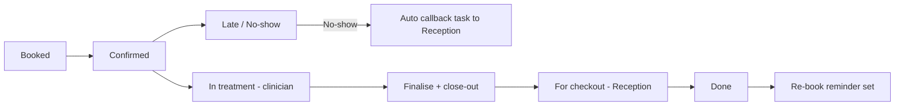
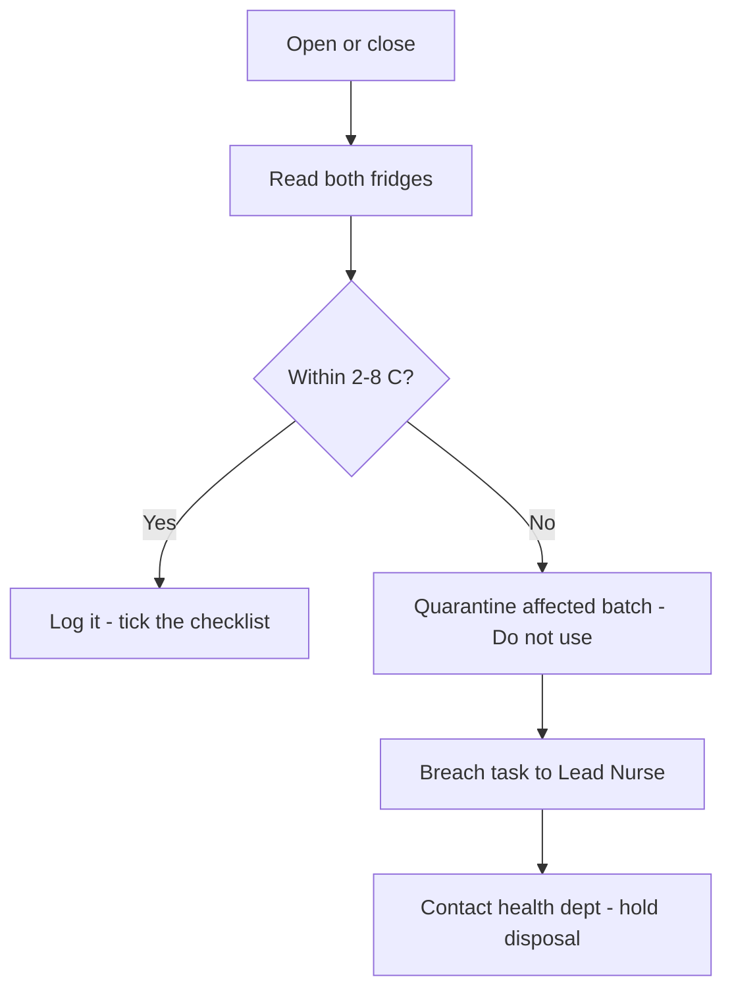

# Chapter 1 — Front desk & daily operations

> *New here? Read [Start here](00-start-here.md) first — it has the glossary and the cast of people.*

This is the engine room of the front of house: getting people booked, getting them through the door
and into a room, keeping a clean record of who they are, and running the small daily routines that
keep the clinic safe and legal. **Mostly Reception's world**, with the Lead Nurse owning the
fridge/equipment routines and the Owner overseeing.

---

## 1. The diary & booking

### The day board ("today")
- **What it is:** the live screen of today's visits — who's waiting, who's in a room, who's ready to
  pay. Think of it as the clinic's air-traffic-control screen.
- **Why it exists:** so anyone can glance up and know the state of the day without asking around.
- **Who it's for:** Reception and all clinical staff, all day.

### The booking wizard
- **What it is:** a simple step-by-step to make an appointment — pick the **service**, then the
  **practitioner**, then a **time**, then the **client**, then confirm.
- **Why it exists:** booking is the most common task; it needs to be fast and hard to get wrong.
- **Who it's for:** Reception (and clients themselves, online — see Chapter 7).
- **Worth checking:** for any **injectable**, the system will only offer a **nurse or nurse
  practitioner** as the practitioner (a skin therapist can't be booked for it), and it automatically
  sends the patient their **intake and consent forms** to complete before the visit. It also asks
  whether the client is **new or returning** (new = full intake; returning = a quick re-check).

### Reminders, reschedule & cancel
- **What it is:** automatic appointment reminders (SMS/app/email) that let the client confirm,
  reschedule or cancel themselves, plus the staff ability to move or cancel an appointment (with a
  reason recorded).
- **Why it exists:** to cut no-shows and save the desk from phone-tag.
- **Who it's for:** clients (self-service) and Reception.

### Cancellation & no-show policy
- **What it is:** the clinic's configurable rules for late cancellations and no-shows.
- **Worth checking:** in the first version there are **no deposits or card holds** required to book —
  that's deliberately left for later. If you feel you need deposits sooner, flag it.

---

## 2. Walk-ins, waitlist & attendance

### Walk-ins & same-day add-ons
- **What it is:** start a visit for someone who turns up without an appointment, or add an extra
  service on the day.
- **The safety catch:** if the walk-in wants an **injectable**, the system still forces the
  consult-first path — you can't shortcut the assessment just because they're standing at the desk.

### Waitlist auto-fill
- **What it is:** a list of clients who'd take an earlier slot. When someone cancels, the system finds
  a **suitable** waitlisted client (right service, right practitioner) and lets Reception offer them
  the slot with one tap.
- **Why it exists:** an empty chair is lost income; this quietly backfills it.

### Late & no-show flags
- **What it is:** mark someone as running late or a no-show. A **no-show automatically creates a
  follow-up call task** so the client gets chased rather than forgotten.
- **Why it exists:** small clinics rarely do formal "check-in"; this lightweight flagging captures the
  same information without the ceremony.

---

## 3. The visit journey (start to finish)

Every appointment moves through clear stages, and the system always shows **whose turn it is to act
next**:

> **Booked → Confirmed → (Late / No-show) → In treatment → For checkout → Done → Recall set**

- **Why it exists:** so a patient never falls through the cracks between the front desk and the
  treatment room and the till. Each hand-off (Reception → clinician → Reception) is explicit.
- **What to look for as a reviewer:** does this match how a visit really flows in your clinic? Are
  there stages you'd add (e.g. a numbing/wait step)?

---

## 4. Client records (the "client 360")

### The client profile
- **What it is:** one screen with everything about a client — contact details, medical history,
  allergies and warnings, tags (VIP, member, first-time, at-risk), past visits, their treatment plan,
  consents, photos, memberships and account balance.
- **Why it exists:** so whoever is with the client has the full picture in one place, and nobody has to
  hunt through paper or multiple systems.
- **Who it's for:** Reception and clinical staff (clinical detail is shown according to role —
  Reception sees less of the clinical record than a nurse).

### Housekeeping
- **What it is:** search and filter the client list, **merge duplicate** records, and "soft-delete"
  (archive rather than truly erase, with an audit trail).
- **Why it exists:** real client lists get messy; clean data keeps recalls and reporting accurate.

### Date of birth & under-18 flag
- **What it is:** the system records date of birth and flags **under-18s**.
- **Why it exists:** under-18s trigger extra protections — a mandatory cooling-off period and a ban on
  advertising to them (covered in Chapters 2 and 7).

### Complaints register
- **What it is:** a place to log a complaint or a bad outcome against a client/treatment, and the
  system surfaces the proper complaint pathways (including the right to complain to **AHPRA**).
- **Why it exists:** the law expects complaints to be recorded and handled properly. (More in
  Chapter 6.)

---

## 5. The daily jobs list (follow-ups)

- **What it is:** a single shared to-do queue that gathers **everything that needs chasing** — replies
  to messages, callbacks, re-book reminders due, consent forms not yet returned, stock tasks, review
  responses, facility tasks. Each job has an owner, a due date, and a status.
- **Why it exists:** in most clinics these to-dos are scattered across sticky notes, inboxes and
  people's memory, and things get dropped. This pulls them into **one list**, and each person sees
  **"my queue"**.
- **Who it's for:** everyone, scoped to their role. Reception works most of them; clinical and the Lead
  Nurse pick up theirs.
- **Worth checking:** incoming messages can be **auto-sorted into jobs** by simple keyword rules (no
  "AI" in the first version), so an unanswered enquiry becomes a tracked task automatically.

---

## 6. Opening, closing & the fridge log

### The cold-chain (fridge) log
- **What it is:** a **twice-daily** record of each medicine fridge's temperature (the "Strive for 5"
  routine — keep it ~5°C, within 2–8°C).
- **Why it exists:** anti-wrinkle toxin is ruined if it gets too warm or cold. If a reading is **out of
  range**, the system flags the affected stock as **"do not use," quarantines it** (don't throw it
  out), and **raises a breach task** to the Lead Nurse to contact the health department for advice.
- **Who it's for:** Reception logs the reading as part of open/close; the Lead Nurse owns breaches.

### Open / close checklist
- **What it is:** a short daily checklist — emergency kit in date, card machine float ready, equipment
  checks done.
- **Why it exists:** consistency; the routine safety/operational checks actually happen and are
  recorded.

---

## 7. Rooms, devices & equipment

### Rooms & devices
- **What it is:** treatment rooms, chairs and machines treated as **bookable resources**, so two
  appointments can't be put in the same room, and the owner can see how well rooms are used
  (utilisation).
- **Why it exists:** prevents double-booking a space and helps spot quiet windows to fill.

### Equipment & maintenance register
- **What it is:** a log of equipment servicing — e.g. **autoclave** (steriliser) validation and spore
  testing, and laser service/calibration.
- **Why it exists:** infection-control and safety standards require proof this maintenance is done.
- **Who it's for:** the Lead Nurse.

---

## 8. The phone (call log)
- **What it is:** a record of inbound calls and missed calls, with the option to text back a missed
  caller, turning it into a callback job.
- **Why it exists:** missed calls are missed bookings; this stops them slipping away.

---

## Roles at a glance

| Role | What they do here |
|------|-------------------|
| **Reception** | Bookings, walk-ins, waitlist, attendance flags, client records, checkout hand-off, calls, the fridge log + open/close checklist, works most jobs |
| **Lead Nurse** | Fridge breaches, equipment maintenance — owns cold-chain integrity |
| **Owner** | Sets up rooms/devices and policies, reviews how busy things are, sees the exceptions list |
| **Clinical (RN/NP/Dermal)** | Watch the day board, pick up their patients, share open/close |

## Questions to ask yourself
- Does the **visit journey** match how a real visit flows here? Any missing stages?
- Are there **booking rules** we rely on (deposits, specific buffers, room rules) that aren't shown?
- Is the **fridge/open-close routine** how we'd actually do it?
- Is there any **front-desk task** we do daily that has no home in this list?

> Next: **[Chapter 2 — Treatments & clinical care](02-treatments-and-clinical.md)**.
