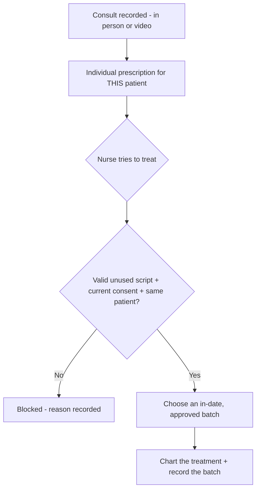
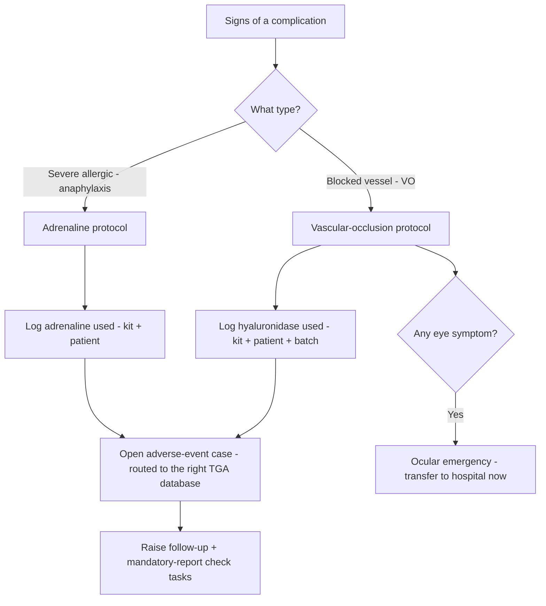

# Chapter 2 — Treatments & clinical care

> *New here? Read [Start here](00-start-here.md) first — it has the glossary and the cast of people.*

This is the heart of the clinic and the part with the most rules, because it involves
**prescription-only (S4) medicines**. The whole design follows one principle: **you cannot record a
treatment unless the things the law requires before it have actually happened.** The safe path is the
only path — there's no "skip" button.

The big idea, in one line:

> **A consult → an individual prescription → valid consent → treatment charted against a specific,
> in-date batch of medicine.** Each link must exist before the next is allowed.

---

## 1. Before the visit — intake & consent

### Intake (the pre-visit questionnaire)
- **What it is:** the patient completes their **medical history, medications, allergies and
  contraindications** on their phone before they arrive.
- **Why it exists:** to surface anything that would make a treatment unsafe, before the patient is in
  the chair, and to save room time.
- **Who it's for:** the client fills it in; the nurse/NP reviews it.

### The BDD / psychological screen
- **What it is:** a short, standard questionnaire that screens for **Body Dysmorphic Disorder** and
  similar concerns, included as part of intake. If it flags, it's surfaced to the prescriber to review
  before proceeding.
- **Why it exists:** cosmetic guidelines require it — for some patients, treatment can do more harm
  than good, and the clinician needs to know before treating.

### Consent (informed and signed)
- **What it is:** the patient reads and **e-signs** a consent form that, in plain language, covers the
  **nature of the procedure, its risks, benefits and alternatives, who is treating them and their
  qualifications, and the cost** — without downplaying complexity or overstating results. It includes
  how to complain (including the right to go to AHPRA, even if they've signed any non-disclosure
  agreement).
- **Why it exists:** valid, informed consent is a legal and ethical must. The system **versions** each
  consent (so you know exactly which wording someone agreed to) and **blocks the treatment** if the
  required consent isn't completed.

### Separate photo consent
- **What it is:** a **separate** consent specifically for any use of photos **beyond the clinical
  record** (e.g. before/after marketing). It records exactly what was agreed and can be **withdrawn at
  any time**, which stops any further use.
- **Why it exists:** using a patient's image is a distinct decision from treating them; the rules
  require it to be consented to separately and revocably.

### Cooling-off (the no-pressure rule)
- **What it is:** a required gap between consent and treatment for **under-18s (7 days)**, during which
  **payment is blocked** (except for the consult itself) and a **second consultation** is offered. For
  **adults there is no legal cooling-off** — but the clinic can switch on an optional one as its own
  policy.
- **Why it exists:** to make sure patients (especially minors) aren't rushed or pressured.
- **Worth checking:** an earlier draft wrongly thought adults had a mandatory 7-day wait — that's been
  corrected. Confirm whether you *want* an optional adult cooling-off as clinic policy.

---

## 2. The consultation & the prescription

### The consult (a real, live assessment)
- **What it is:** a **real-time** assessment of the patient by a prescriber — either **in person** or
  **by video** (the video call itself happens in your existing telehealth app; this system records
  that it took place, who did it, when, and the notes).
- **Why it exists:** by law, an S4 cosmetic medicine can't be prescribed without a genuine,
  synchronous consult. No forms-only, no text-message prescribing.

### The individual prescription
- **What it is:** after the consult, the prescriber writes a prescription **for that one named
  patient** — the product, dose and quantity.
- **Why it exists:** the law requires **one prescription per patient per consult**. "Batch" or
  "standing-order" scripts (one script covering many patients) are **not allowed** for these
  treatments, and the system simply won't let you create one.
- **Off-label flag:** if the medicine is being used off-label (common in cosmetics), the prescriber
  flags it and the consent must cover it.

### Who can prescribe
- **Nurse Practitioner (NP)** — prescribes and may hold the stock on site.
- **Remote prescriber (doctor/NP by video)** — prescribes by video; holds no stock here.
- **Designated RN prescriber** — a newer role: an RN with extra qualifications who may prescribe **in
  partnership with** an authorised prescriber. The system only unlocks this once it has verified their
  endorsement **and** recorded their partnered prescriber.
- A plain **RN gives** the injection but **cannot prescribe**.

---

## 3. Charting the treatment

This is the clinical record of what was actually done. It **adapts to the treatment type** (the
"modality"):

### Injection mapping (for anti-wrinkle & filler)
- **What it is:** the nurse marks each injection on a **face diagram and/or the patient's photo**, and
  each point records the **product, the number of units, the depth, the technique, and the batch/lot
  and expiry**. The first version is **manual** (tap to add a point, drag to move) — no automatic
  point-detection.
- **Why it exists:** this is the precise, defensible record of treatment, and it's what links every
  unit of medicine to a patient and a batch.

### Other treatment types
- **Skin / facials** — a simpler note (areas, device, settings, products used); no prescription or
  batch needed because they're non-S4.
- **Laser / energy devices** — a settings logbook with skin-typing, patch tests and safety checks, and
  it's **blocked unless the practitioner holds the required state laser licence**.
- **Filler** — multi-area, possibly multiple syringes, batch per area, **plus a specific consent gate
  for the risk of vascular occlusion / blindness**.
- **Weight-loss (GLP-1)** — a dose-titration plan; the system **blocks prohibited compounded versions**
  and only allows approved branded products.

### Before/after photos
- **What it is:** standardised photos (consistent poses, with an on-screen "ghost overlay" to line up
  the new photo with the old) taken room-side, compared side-by-side across visits.
- **Why it exists:** to track outcomes objectively. Photos are stored **securely and centrally — never
  on a staff member's personal phone** — and only used beyond the record if photo consent was given.

### Locked records (immutable)
- **What it is:** once a note is **finalised it's locked**. Any later change is added as a **visible,
  dated amendment**, never a silent edit.
- **Why it exists:** clinical records must be trustworthy and tamper-evident for audits and any legal
  matter.

### The guided close-out
- **What it is:** finishing a treatment walks the clinician through a tidy close-out — send aftercare
  instructions, set the re-book reminder (recall), schedule a wellbeing check-in call, and log any
  adverse event — before handing the patient to the desk for payment.
- **Why it exists:** it makes the right follow-up steps automatic instead of relying on memory.

---

## 4. When something goes wrong — complications

- **What it is:** a guided response for serious complications — a **vascular occlusion (a blocked
  vessel — a filler emergency)** or **anaphylaxis (a severe allergic reaction)**. It walks the
  clinician through the protocol, logs the emergency medicine used (e.g. **hyaluronidase** or
  adrenaline) against the kit, the patient and the batch, and **opens an adverse-event case** that
  routes to the correct reporting database (see Chapter 6). If there's an eye symptom, it flags an
  ocular emergency — transfer to hospital now.
- **Why it exists:** in an emergency you want a checklist, not a blank page — and the record needs to
  capture everything for both the patient's safety and the mandatory follow-up.
- **Who it's for:** the treating RN/NP, with Lead Nurse oversight.

---

## 5. Treatment plans & outcomes
- **Treatment plans / protocols:** a client can have a **multi-session plan** (e.g. a maintenance or
  needling course), and staff can apply a template that schedules those sessions into the re-book list.
- **Outcomes & revisions:** tracking touch-ups, satisfaction and any complication **by treatment type
  and practitioner** — useful for quality and for the owner's reporting.

---

## Roles at a glance

| Role | What they do here |
|------|-------------------|
| **Nurse Practitioner** | Consults, prescribes, holds the stock, manages complications, signs weight-loss plans |
| **Registered Nurse** | Reviews safety before treating, administers on a valid script, charts, runs the complication protocol |
| **Dermal / laser therapist** | Non-injectable skin & (licensed) laser treatments only |
| **Lead Nurse** | Oversees clinical safety, the emergency kit and drills |
| **Client** | Completes intake, the BDD screen and consent ahead of time |

## Questions to ask yourself
- Do the **consent and intake** forms cover everything you'd expect (and everything your insurer
  wants)?
- Is the **consult → prescription → treatment** chain how it legally works for you? Any prescriber
  arrangement (e.g. your telehealth doctor) not represented?
- Does **charting** capture what your clinicians actually record today?
- Is the **complication workflow** something your team would trust in a real emergency?

> Next: **[Chapter 3 — Medicines & stock](03-medicines-and-stock.md)**.
