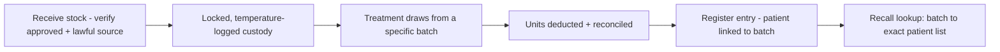

# Chapter 3 — Medicines & stock

> *New here? Read [Start here](00-start-here.md) first — it has the glossary and the cast of people.*

This chapter is about the **physical medicines and products** — buying them, storing them safely,
tracing every unit to a patient, and proving it all if asked. For prescription-only (**S4**) medicines
like anti-wrinkle toxin, this isn't just good housekeeping — it's a legal obligation, and it's where a
lot of clinics get caught out. The system is built so the **medicine register basically writes itself**
as you work.

---

## 1. The product list (catalogue)

- **What it is:** the master list of everything the clinic sells or uses, each item tagged with its
  **type** (toxin / filler / skin / device), its **unit** (e.g. "units" for toxin, "syringes/mL" for
  filler), a **par level** (the minimum you want in stock), and crucially an **S4 flag** (is this a
  prescription-only medicine, yes/no).
- **Why it exists:** that single **S4 flag** is the switch that drives the strict rules everywhere — it
  decides what needs a prescription, what can't be discounted or advertised, and how adverse events are
  reported. Set it right once, and the rest of the system behaves correctly.
- **Who it's for:** a permitted "catalogue admin" (typically the NP or owner) adds/removes products and
  sets that flag.

---

## 2. The S4 medicine ledger (the legal record)

This is the regulated stock record for prescription medicines. In the first version the clinic uses
**"Mode A" — on-site stock held by an on-site prescriber** (the common setup). A future "Mode B"
(pharmacy dispenses per patient) is designed for but not built yet.

Every step is recorded:

| Step | What's captured | Why it matters |
|------|-----------------|----------------|
| **Receiving stock** | The product, batch/lot, expiry, who received it, that it's **TGA-approved (on the ARTG)** and came from a **lawful wholesaler** | You must only use approved medicine from a legitimate source — using unapproved/counterfeit stock is a top enforcement target with huge penalties |
| **Custody** | Who legally holds the stock | By law, only an **on-site prescriber** may hold S4 stock; the system records the custodian and an **exclusive-custody attestation** |
| **Secure storage** | Which locked cabinet/room it's in; access is restricted and logged | S4 medicines must be locked away with access controlled |
| **Cold-chain** | The fridge temperature, logged twice daily, with breach alerts | Toxin must stay at **2–8°C** or it's compromised (see Chapter 1's fridge log) |
| **Administration** | The batch, units, prescriber, who gave it, the patient, date/time | This is the heart of traceability — and it's captured automatically when the nurse finalises the treatment |
| **Wastage & reconciliation** | Units drawn vs vial size, and what was wasted | So stock, billing and the register all agree (no "missing" medicine) |
| **Disposal / destruction** | Witnessed destruction (including part-used vials), via a licensed/return-medicine pathway, with certificates kept | Required proof that medicines were disposed of properly |
| **Stocktake** | Periodic counts; any discrepancy is flagged; a loss/theft process exists | Catches errors or missing stock early |

---

## 3. Batch tracing & recalls

- **What it is:** because every administration records the **batch/lot**, the system can answer
  instantly: *"Which patients received batch X?"*
- **Why it exists:** if a manufacturer or authority **recalls a batch** (a field-safety notice), you
  must be able to find and contact exactly the affected patients — fast. Doing this by hand through
  paper records is slow and error-prone; here it's one lookup.
- **Who it's for:** the NP/owner authorises the recall; it then feeds the safety-campaign tools in
  Chapter 6.

---

## 4. Expiry, par levels & "use-first"

- **What it is:** the system tracks expiry per batch and nudges staff to **use the
  earliest-expiring stock first**, and signals when a product drops **below its par level** (time to
  reorder).
- **Why it exists:** to minimise waste from expiry and to avoid running out mid-list.

---

## 5. Buying & retail stock *(mostly planned for later)*

- **Supplier purchase orders & receiving:** reorder below-par items as a purchase order. For **S4**
  items, the order needs a **prescriber to sign it** and must go to a **TGA-approved wholesaler**.
- **Device & equipment register:** machines (class, approval, service/calibration dates).
- **Retail (non-S4) inventory:** ordinary stock control for skincare/retail — barcode, cost, margin,
  supplier, par.
- **Worth checking:** these are largely **later-phase** items; the first version focuses on the S4
  ledger. If supplier ordering or retail stock control is urgent for you, flag it.

---

## Roles at a glance

| Role | What they do here |
|------|-------------------|
| **Nurse Practitioner** | Holds S4 custody, receives stock, manages the catalogue & S4 flag, authorises recalls |
| **Lead Nurse** | Day-to-day stock, cold-chain, wastage, par/expiry, stocktakes |
| **Reception** | Logs the fridge temperatures during open/close |
| **Owner** | Read-only oversight — sees stock-on-hand and expiry on the dashboard |

## Questions to ask yourself
- Does this match **how you actually receive, store and record** your toxin/filler today?
- Is the **custody** arrangement (who legally holds the stock) correct for your clinic's setup?
- Would the **recall lookup** give you confidence in an inspection or a real recall?
- Do you need **supplier ordering / retail stock control** in the first version, or can it wait?

> Next: **[Chapter 4 — Money, memberships & reporting](04-money-and-memberships.md)**.
