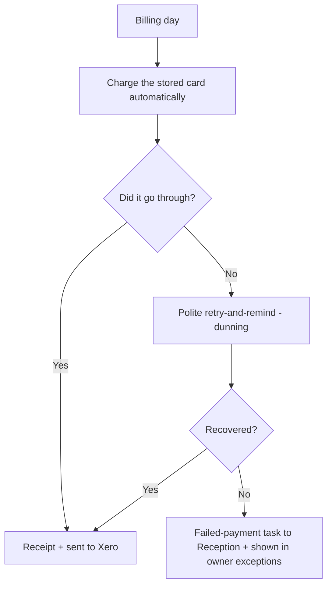
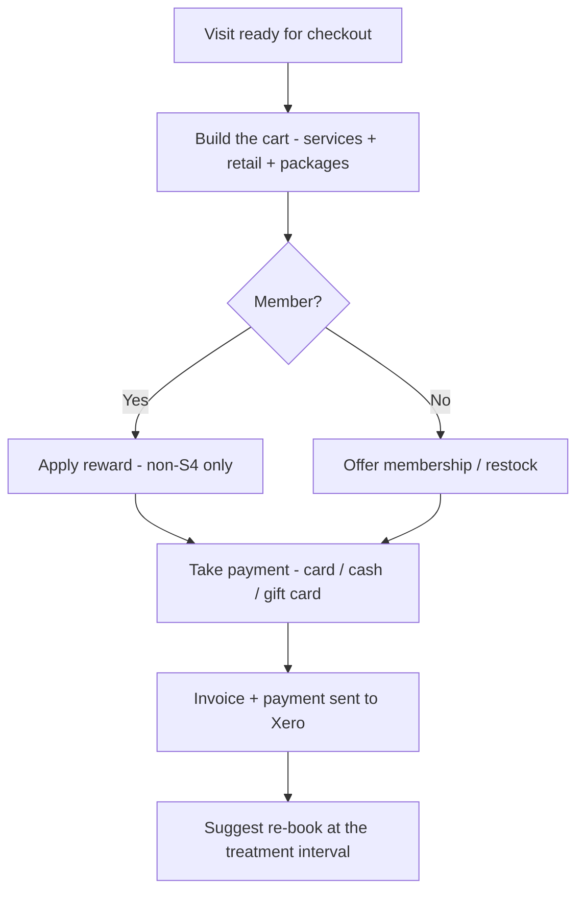
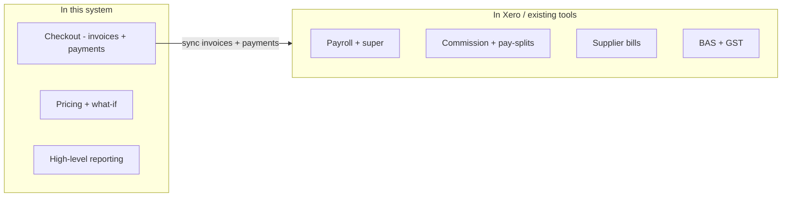

# Chapter 4 — Money, memberships & reporting

> *New here? Read [Start here](00-start-here.md) first — it has the glossary and the cast of people.*

This chapter covers taking payment, the membership and loyalty engine, and the handful of numbers the
owner watches. One important boundary up front: **the clinic's actual accounting "books" live in
Xero** (payroll, tax, supplier bills). This system is the **till and the commercial levers** — it
sends sales data across to Xero rather than trying to be accounting software.

> **An important rule throughout:** money figures (revenue, pricing, MRR) are **owner-only**.
> Reception can sell memberships and take payment, but does **not** see the revenue dashboards.

---

## 1. Taking payment (checkout / POS)

- **What it is:** the checkout at the end of a visit — pay by **card (Square)** or **recorded cash**,
  redeem a **gift card**, redeem a pre-paid **package**, print/email a receipt, split payments, add
  tips, apply a surcharge.
- **Why it exists:** it's the till; it needs to be quick and to feed everything else (reporting,
  Xero, rebooking).
- **Who it's for:** Reception.
- **First version note:** payments are **in person** to start. Customer-facing **online checkout** for
  one-off purchases is planned for later (the one exception that *is* included is storing a card for
  membership autopay).

### Checkout assist (gentle prompts)
- **What it is:** subtle, **staff-facing** nudges at the till — offer a membership to a non-member,
  suggest a restock based on past purchases, show a quick rapport panel, and after payment suggest a
  **re-book** at the right interval (anti-wrinkle ~12 weeks).
- **Why it exists:** to lift retention and average spend without being pushy. It never auto-charges
  anything.

---

## 2. Memberships, packages & gift cards

### Memberships with autopay
- **What it is:** recurring paid plans (monthly/annual). The member's card is stored securely
  (**card-on-file**) and **charged automatically** each cycle. If a charge fails, a polite
  **retry-and-remind** process (**dunning**) kicks in, and an unresolved failure becomes a task for
  Reception and shows in the owner's exceptions list.
- **Why it exists:** predictable recurring income (**MRR**) and a reason for clients to keep coming
  back. The card can be added **online or in the app** — it doesn't have to be done at the desk.

### Packages / series
- **What it is:** sell a bundle ("course of 3") and redeem the visits over time, tracking "visits
  remaining" and any account credit.

### Gift cards
- **What it is:** sell and redeem gift cards and track their balances; usable at checkout.

---

## 3. Rewards, loyalty & referrals

- **What it is:** visit-based rewards (e.g. a perk every Nth visit), member benefits, a points/loyalty
  idea, and a **referral** program (give/get credit).
- **The crucial catch — rewards on non-S4 items only:** the system **blocks** earning, redeeming or
  discounting against any **S4** item (the toxin/filler itself). Rewards can only apply to
  **non-S4** things — skincare, retail, non-S4 add-ons, or account/gift credit.
- **Why that catch exists:** two reasons at once — it protects your **profit margin** (you're not
  discounting your most regulated, cost-sensitive product) and it **respects the advertising law**,
  which forbids promoting or price-discounting prescription medicines.
- **Margin-aware rules:** the owner can set caps and choose which (ideally high-margin) items are
  eligible, and see **reward-cost vs retention** so incentives don't quietly erode profit.
- **Worth checking:** full loyalty *campaigns* and deep referral automation are **later-phase**; the
  first version ships the core mechanics. The exact tiers, prices and reward rules still need to be
  decided by you.

---

## 4. Pricing & "what-if" planning (owner)

- **What it is:** a planning tool for the owner to model a price or plan change and see the **projected
  impact on revenue and MRR** before committing. A change is only a **proposal** until it's applied
  through the proper, audited settings.
- **Why it exists:** so pricing decisions are informed, not guesswork — without risk of accidentally
  changing live prices while you experiment.
- **Worth checking:** the projection is a **planning estimate** (it depends on a churn assumption and
  your real cost/margin data), not a guarantee.

---

## 5. The numbers the owner watches (reporting)

- **What it is:** dashboards rebuilt on live data — **revenue, treatment mix, retention/churn,
  no-shows, cancellations, conversion, at-risk clients, top spenders, membership MRR/churn, and
  per-practitioner** figures — all filterable by date.
- **Why it exists:** reporting was a top frustration with the old system; here it's a first-class
  feature, not an afterthought.
- **The "needs attention" digest:** one exceptions view that pulls together the things an owner should
  act on — failed payments, expiring stock, lapsing registrations, open complaints, overdue re-books,
  unbilled visits — each linking straight to where you fix it.

---

## 6. What lives in Xero (not here)

To keep things simple and avoid rebuilding accounting, these stay in **Xero / the clinic's existing
tools**: payroll & super, commission/pay-splits, supplier bills (accounts payable), refund
reconciliation, and **BAS/GST** lodgement. The system **sends invoices and payments across to Xero**
automatically so the books reconcile without re-keying, and it can produce **GST-coded** line data and
a commission/pay attribution summary as a hand-off — but it is **not** a payroll or tax engine.

---

## Roles at a glance

| Role | What they do here |
|------|-------------------|
| **Reception** | Takes payment, applies rewards, sells memberships/gift cards, re-books |
| **Owner** | Sets prices, plans & deals; runs what-if; sees MRR, reporting & exceptions |
| **Bookkeeper / accountant** | Owns the ledger in Xero — payroll, supplier bills, BAS, reconciliation |
| **All staff** | Discounts/rewards are automatically blocked on anything S4 |

## Questions to ask yourself
- Are all the **ways you take payment** here (card, cash, gift card, packages, BNPL like Afterpay)?
- Do the **membership and rewards** ideas fit your commercial model? What tiers/prices would you want?
- Is the **non-S4-only rewards rule** clear and acceptable to you?
- Are the **reports** the ones you'd actually use to run the business? Anything missing?
- Are you comfortable that **accounting stays in Xero**, with sales flowing across?

> Next: **[Chapter 5 — The team & their credentials](05-team-and-people.md)**.
