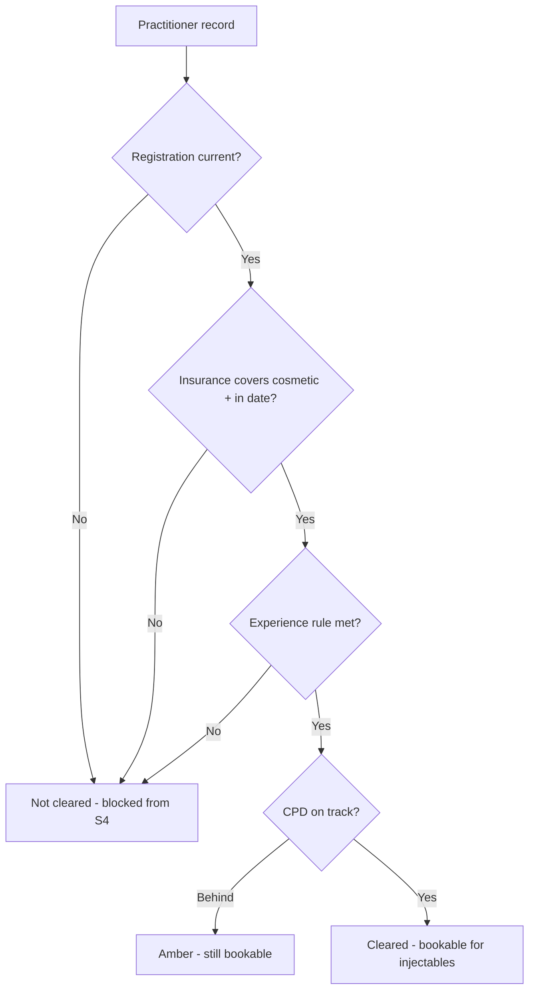

# Chapter 5 — The team & their credentials

> *New here? Read [Start here](00-start-here.md) first — it has the glossary and the cast of people.*

This chapter is about the staff: who's working when, and — the critical part for an injecting clinic —
**whether each person is legally clear to treat right now**. The system ties three things together
(registration, training, insurance) into a single "are they cleared?" status, and uses it to decide
who can even be booked for injectable work.

---

## 1. Roles & "who can do what" (scope of practice)

- **What it is:** every staff member has a **role**, and each role comes with a set of permissions that
  match what that role is trained and legally allowed to do. The system enforces these limits
  automatically — for example, a skin therapist can't be booked for injectables, and only a prescriber
  can hold the S4 stock.
- **Why it exists:** in cosmetic injecting, "scope of practice" is the law, not a preference. Building
  the limits into the software means a serious mistake can't happen just because someone clicked the
  wrong thing.
- **How it's built:** roles are made from small permission "building blocks", so the clinic isn't
  locked into rigid job titles. There are ready-made roles (NP, Lead Nurse, RN, dermal, reception,
  owner) plus combined presets (e.g. "solo NP", "nurse-led RN", "designated RN prescriber"). A
  custom-role builder is a future addition.

> See the full **cast of people** table in [Start here](00-start-here.md#the-people-whos-who).

---

## 2. Roster & leave

- **What it is:** who's working which shifts at which location, plus leave.
- **Why it exists:** the roster **drives the booking availability** — a practitioner only appears as
  bookable when they're rostered on.
- **Who it's for:** the Lead Nurse runs the roster; the owner oversees.

---

## 3. Credentials, training & insurance

For each practitioner the system stores the evidence that they're allowed to practise:

| Record | What it is | Why it's tracked |
|--------|------------|------------------|
| **AHPRA registration** | Their national registration number, type, expiry, and any conditions/endorsements | If it lapses or is restricted, they legally can't practise — the system **blocks** their clinical actions |
| **Experience rule** | A flag confirming the required prior nursing experience (≥1 year non-cosmetic) before doing cosmetics | A specific requirement in the cosmetic guidelines |
| **CPD (training hours)** | Ongoing professional-development hours logged against the annual target | Required to keep registration current |
| **Indemnity insurance (PII)** | Insurer, policy, expiry — and critically a **"covers cosmetic" flag** | Practitioners must be insured, and the cover must specifically include cosmetic work |

- **Who maintains them:** practitioners log their own CPD and upload their own evidence; the owner/Lead
  verify and manage.
- **Verification:** checking registration against AHPRA can be automated (a paid lookup service) but a
  **manual check is always available as the fallback** — the system doesn't depend on the automated
  route.

---

## 4. The "cleared to treat" board

- **What it is:** the system combines registration + experience + insurance + training into one status
  per practitioner — effectively **"can this person inject today, yes/no?"** If any required piece
  fails (registration lapsed, insurance doesn't cover cosmetic, etc.), they're flagged **not bookable**
  for injectable slots and drop out of the booking list. If only CPD is behind, they're flagged amber
  but can still be booked.
- **Why it exists:** it answers the daily question *"are we actually cleared to open for injectables?"*
  at a glance, and it prevents an out-of-date practitioner from being booked by accident.
- **Expiry handling:** approaching expiries (registration, CPD, insurance) automatically become
  follow-up tasks so nothing lapses unnoticed.

---

## 5. Employment details
- **What it is:** whether each person is an employee or contractor, and any commission split.
- **Why it exists:** it feeds a compliance banner and the pay-attribution hand-off to Xero (the actual
  payroll happens in Xero — see Chapter 4).

---

## Roles at a glance

| Role | What they do here |
|------|-------------------|
| **Owner** | Manages people, employment type and insurance; sees the "cleared to treat" board and exceptions |
| **Lead Nurse** | Runs the roster, approves leave, watches registration/CPD/insurance currency |
| **Each practitioner** | Logs their own CPD, uploads their own registration/insurance evidence, views their profile |

## Questions to ask yourself
- Are all the **roles** in your clinic represented, with the right limits?
- Does the **"cleared to treat" logic** match what your insurer and AHPRA actually require?
- Are there **credentials or checks** you keep (e.g. police checks, first-aid, specific course
  certificates) that aren't listed here?
- Is **roster-drives-availability** how you'd want bookings to work?

> Next: **[Chapter 6 — Compliance & safety](06-compliance-and-safety.md)**.
