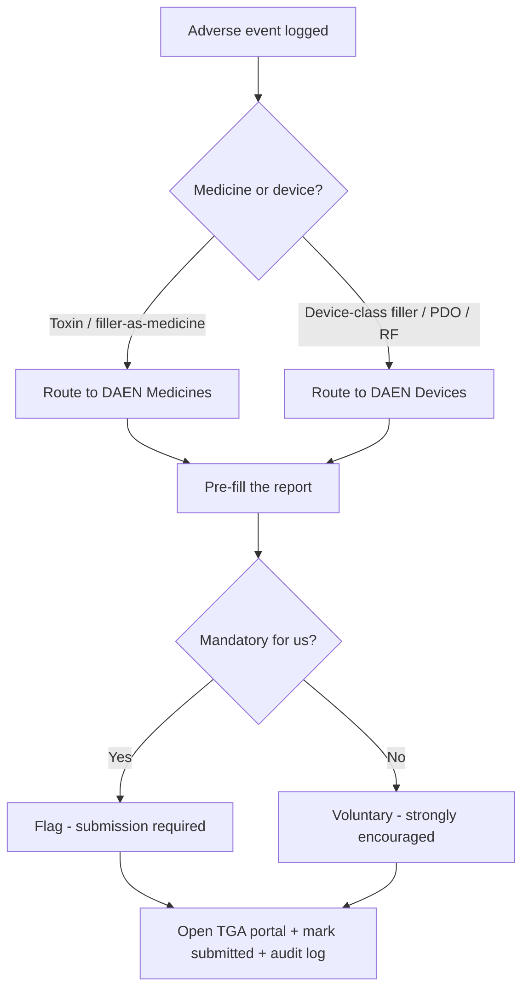

# Chapter 6 — Compliance & safety

> *New here? Read [Start here](00-start-here.md) first — it has the glossary and the cast of people.*

This chapter is the safety net. Most compliance is **woven invisibly into the everyday flows** you've
already seen (you can't treat without consent, you can't book a lapsed practitioner, and so on). But
some compliance work needs its own home — reporting a bad outcome, running a recall, signing off
policies, handling a privacy request, and producing evidence for an inspection. That home is the
**governance hub**, owned by the **Owner / compliance officer**, with the **NP** and **Lead Nurse**
helping.

This is also where we list, in plain English, the **24 compliance rules** the whole system is built
around — so you can check none are missing.

---

## 1. The governance hub (compliance officer's desk)

### Overview digest
- **What it is:** a daily summary of open compliance items — adverse-event cases, unsigned policies,
  active recalls, accreditation/expiry countdowns.
- **Why it exists:** so nothing compliance-critical drifts out of sight.

### Adverse-event reporting (DAEN)
- **What it is:** when a bad reaction is logged (from the complication flow in Chapter 2), the system
  **routes it to the correct TGA database** (medicine vs device), **pre-fills** the report, **flags
  whether reporting is mandatory** for your clinic type, and hands off to the TGA portal — then records
  that it was submitted.
- **Why it exists:** reporting serious reactions is expected (and sometimes legally required); doing it
  by hand is fiddly and easy to skip.

### Recall execution
- **What it is:** turn a recalled batch into a patient safety campaign — get the **exact patient list**
  (from Chapter 3), choose how to contact them (SMS + call), send the safety notice (which **bypasses
  the advertising rules**, because it's safety not marketing), and **track who acknowledged it**.

### Policies & sign-off
- **What it is:** store the clinic's policies and procedures with versions; when one is published or
  updated, **every staff member is asked to read and acknowledge** it, and the hub shows who hasn't.

### Infection control & waste
- **What it is:** the infection-control log and **clinical/sharps waste manifests** (the records of
  regulated waste being collected and disposed of properly).

### Privacy (handled where it's actionable, not as a hub register)
- **What it is:** privacy work deliberately **doesn't get its own register tab** in the hub — a static
  list of requests adds little. Instead it lives where someone can act on it: clients **see, export and
  request deletion** of their own data in the **client app**, and **data-breach response** is a
  versioned, signed-off **policy** (above) that's invoked if an incident occurs.
- **Why it's done this way:** the obligations (DSAR access/correction, NDB breach assessment — C21/C22)
  are still covered, but as a self-service surface plus a live policy rather than a passive register.

### The audit / inspection pack
- **What it is:** a **one-click bundle** of dated evidence for an inspection or review.
- **Why it exists:** if AHPRA or QLD Health come knocking, you can produce the evidence in minutes
  rather than days.

---

## 2. Advertising rules (why marketing feels restricted)

A theme you'll keep meeting: **you cannot advertise or promote a prescription (S4) medicine to the
public.** This is TGA/AHPRA law, and it's stricter than most people expect.

- **What it means in practice:** no brand names or nicknames (e.g. "Botox", "baby botox"), no generic
  giveaways ("anti-wrinkle injections", "dermal fillers"), no prices for these treatments, no banned
  hashtags, no promotional before/after or syringe imagery, no influencer testimonials, no targeting
  under-18s — anywhere public, including your **own booking page**.
- **How the system handles it:** the app deliberately does **not** build advertising or marketing
  tools — your campaigns and social posts live in your existing tools (Mailchimp, Meta Business Suite),
  where this compliance is your responsibility. The one public page the app *does* own — your **booking
  page** — is set up with **generic service names and S4 prices hidden**, by configuration.
- **Why it's done this way:** these rules are a named enforcement priority with serious penalties, and
  the safest place to manage advertising is where you actually create it — not behind an automated
  checker that can give false confidence.

*(More on the day-to-day messaging side in [Chapter 7](07-growth-communications-and-apps.md).)*

---

## 3. The 24 compliance rules, in plain English

Every rule below is something the system is built to enforce or support. Use this as a checklist:
*is anything your clinic must comply with missing here?*

### Prescribing & assessment
- **C1 — A consult before every script.** You can't record a prescription for an S4 cosmetic medicine
  without a real, live consultation linked to it.
- **C2 — Individual scripts only.** One prescription, one patient, one consult — no "batch" or
  standing-order scripts.
- **C3 — Proper assessment.** A holistic assessment including the BDD (psychological) screen, done by a
  nurse or NP, before treatment.
- **C4 — Only qualified people.** Practitioners must meet the experience and training requirements; the
  system enforces this.
- **C19 — Registration stays current.** Lapsed or restricted registration **blocks** clinical actions
  automatically.

### Consent & the patient
- **C5 — Real informed consent.** Plain-language, signed consent covering risks, benefits,
  alternatives, the practitioner's qualifications and the cost — without minimising or overselling.
- **C6 — No pressure / cooling-off.** A mandatory 7-day cooling-off for under-18s (payment blocked
  meanwhile); for adults, adequate time and no pressure (optional clinic cooling-off available).
- **C14 — Separate photo consent.** A distinct, withdrawable consent for any use of images beyond the
  record; images never kept on personal devices.
- **C18 — Records & how long to keep them.** Detailed records, kept for the legally required periods
  (adults ≥7 years; minors until they're 25), with a proper destruction register.
- **C21 — Privacy.** Patients can see and correct their data; data is only used for agreed purposes and
  isn't sent overseas without safeguards.

### Medicines & stock
- **C7 — Proper custody.** S4 stock held only by an on-site prescriber with exclusive custody (nurses
  never hold bulk stock).
- **C8 — Traceability & recall.** Batch and expiry recorded at every administration; instant "which
  patients got this batch?" lookup.
- **C11 — Approved, lawfully-supplied products.** Only TGA-approved (ARTG) medicine from a legitimate
  wholesaler; unapproved/unverified stock is flagged or blocked.
- **C13 — Cold-chain.** Temperature kept and logged within range (2–8°C), with breach alerts.
- **C15 — Secure storage.** Locked away, access restricted and logged.
- **C16 — Proper disposal.** Witnessed destruction (including part vials) via a licensed pathway, with
  certificates kept.
- **C17 — Stocktakes & discrepancies.** Regular reconciliation; discrepancies flagged; a loss/theft
  process.

### Safety, facility & emergencies
- **C12 — Report adverse events.** Capture and route adverse-event reports to the right TGA database;
  flag the ones that are mandatory.
- **C20 — Facility, infection control & emergencies.** Infection-control logs, an emergency kit (e.g.
  hyaluronidase, anaphylaxis) tracked for expiry, and a back-up plan when the treating practitioner is
  unavailable. *(Formal cosmetic-surgery facility accreditation is only needed if you also do licensed
  surgery — not for a non-surgical injectables clinic.)*

### Privacy, data & marketing
- **C10 — Australian hosting, audit & retention.** Patient data stored in Australia, with a full audit
  trail and proper retention.
- **C22 — Data-breach handling.** Detect, assess and (if serious) report data breaches to the regulator
  and affected people.
- **C23 — Marketing consent.** Only message people who opted in; identify the sender; always allow
  unsubscribe.
- **C9 — Advertising guardrails.** No public promotion of S4 medicines anywhere (see section 2 above).

### Complaints
- **C24 — Complaints register & pathways.** Record complaints/bad outcomes and surface the proper
  complaint routes, including AHPRA (and that a non-disclosure agreement never removes that right).

---

## Roles at a glance

| Role | What they do here |
|------|-------------------|
| **Owner / compliance officer** | Owns the hub: adverse-event submission tracking, recalls, policy publishing, audit packs |
| **Nurse Practitioner** | The clinical "how serious is this?" call on adverse events; authorises recalls |
| **Lead Nurse** | Infection-control log, waste manifests, emergency-kit currency |
| **All staff** | Sign policies; the everyday guardrails stay enforced in their normal work |

## Questions to ask yourself
- Reading the **24 rules**, is there any obligation your clinic has that **isn't** represented?
- Is the **adverse-event / recall** support something you'd trust in a real incident?
- Do the **advertising restrictions** match what you've been told you can and can't say?
- Could you produce an **inspection pack** today, and would this give you that confidence?

> Next: **[Chapter 7 — Growth, communications & the apps](07-growth-communications-and-apps.md)**.
