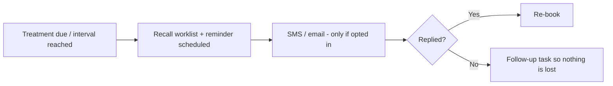

# Chapter 7 — Growth, communications & the apps

> *New here? Read [Start here](00-start-here.md) first — it has the glossary and the cast of people.*

This chapter covers how the clinic talks to clients, keeps them coming back, attracts new ones, and
the two phone apps. It all operates under the **advertising rules** from [Chapter 6](06-compliance-and-safety.md#2-advertising-rules-why-marketing-feels-restricted)
— you can't promote the prescription medicine itself.

> **Boundary:** big email newsletters and social-media posting are **handled in the clinic's existing
> tools** (Mailchimp, Meta Business Suite), not rebuilt here. This system focuses on conversations,
> reviews, reminders/recall and the booking page.

---

## 1. Messages & conversations

### The unified inbox
- **What it is:** Instagram, Facebook, SMS and email messages brought into **one list**, automatically
  sorted (pricing question / booking / complaint), linked to the client where possible, with
  **suggested replies** (template/keyword-based — no "AI" in the first version) that staff edit before
  sending.
- **Why it exists:** so enquiries from every channel land in one place and none are missed, and so the
  team isn't hopping between five apps.
- **Worth checking:** the social-channel parts (IG/FB two-way messaging) are **later-phase** and need
  technical validation; **SMS and email are in the first version**. Proactive marketing stays on
  SMS/email (social channels are for *replying* to people who message you).

### Staying inside the advertising rules
- **What it is:** a reminder of the boundary from [Chapter 6](06-compliance-and-safety.md#2-advertising-rules-why-marketing-feels-restricted) —
  you can't publicly promote a prescription (S4) medicine. A **private 1:1 reply** about price to
  someone who messaged you is fine; a **public post or page** naming or pricing the medicine is not.
- **How it's handled:** the app deliberately doesn't build campaign/marketing tooling (that lives in
  your existing tools, where the compliance is your responsibility). The one public surface the app
  owns — the **booking page** — is configured with generic names and S4 prices hidden, and review
  *re-sharing* of S4 testimonials is avoided (see below).

---

## 2. Reminders & re-booking (recall)

- **What it is:** automatic appointment **reminders** (confirm/decline), **aftercare** message
  sequences after a treatment, and **recall** nudges when a treatment is due again (anti-wrinkle ~12
  weeks). Reception works a **re-book worklist** of clients who are due.
- **Why it exists:** retention. Gentle, well-timed nudges bring clients back, and a worklist means
  no due client is forgotten. Any client who doesn't reply becomes a follow-up task (Chapter 1).
- **Consent rule:** marketing only goes to people who **opted in**, and every message can be
  **unsubscribed** from (the Spam Act).

---

## 3. Reviews & reputation

- **What it is:** request reviews from **all** clients (not just the happy ones — "review gating" is
  discouraged), reply to them, **acknowledge** them, and **auto-flag negative reviews or complaints**
  for follow-up by the right person.
- **Why it exists:** reputation is a major growth driver, but it must be done fairly and within the
  rules.
- **The catch:** a glowing review that names an **S4 result** can be replied to, but **can't be
  re-shared/reposted** by the clinic — that would be a prohibited testimonial promoting the medicine.

---

## 4. Leads & the public booking page

### Lead / prospect tracking
- **What it is:** a simple pipeline over the inbox — enquiry → consult booked → converted or lost — so
  the clinic can see where new business is coming from and chase warm leads.

### Public booking page
- **What it is:** the page where the public books online. Because the page is itself "advertising,"
  injectable services are listed with **generic names and prices withheld**.
- **Why it exists:** to take bookings online while staying inside the advertising rules.

---

## 5. The two phone apps

The plan includes **two apps** (built to work on both iPhone and Android):

### Client app
- **What it is:** for patients — book/reschedule, complete intake and consent, view their before/after
  photos (if consented), see memberships, rewards and balances, add a card for membership autopay, and
  receive reminders and recall nudges.
- **Why it exists:** to give clients a convenient self-service experience and reduce desk workload.

### Provider app
- **What it is:** for clinicians in the treatment room — see their day, open a patient (only once
  consult and consent are verified), **map injections and take photos room-side**, record the consult
  / link the script, finalise the chart, and log adverse events.
- **Why it exists:** charting should happen at the chair, on a tablet, not later from memory.
- **Important detail:** the provider app **keeps working if the Wi-Fi drops** — notes and photos queue
  locally and sync when the connection returns, so nothing is ever lost (a known failure of some older
  systems).

---

## 6. Behind the scenes — sign-in, security & integrations

These are the "plumbing" features. You won't see them, but they matter for trust and for the law.

- **Signing in:** staff sign in with their **existing Microsoft 365 work accounts** (plus a second
  security check); clients sign in with **Google/Apple, email + password, or a one-time code**.
- **Security & privacy:** patient data (including photos) is **stored in Australia**, encrypted, with a
  full **audit trail** of who viewed or changed what. Finalised clinical notes are **locked** against
  silent edits.
- **Patient data rights:** patients can **see and correct** their own information; the clinic controls
  whether any data goes to outside services, keeping them Australian-based or properly assessed.
- **Integrations:** **Xero** (sales/payments flow to the books), **calendar sync** (appointments appear
  in Outlook/Google and external busy-time blocks availability), and an **SMS provider**.
- **Worth checking:** two-way calendar sync and electronic prescribing are flagged as needing technical
  validation and may be later-phase.

---

## Roles at a glance

| Role | What they do here |
|------|-------------------|
| **Reception** | Works the inbox, converts leads, replies to reviews, runs reminders/recall |
| **Lead Nurse** | Handles flagged unhappy/clinical reviews and complaint callbacks |
| **Owner** | Growth oversight and reporting; configures the public booking page and referrals |
| **Clients & clinicians** | Use the client and provider apps respectively |

## Questions to ask yourself
- Are the **channels** your clients actually use covered (and in the right phase)?
- Does the **reminder/recall** approach match how you keep clients returning?
- Is the **reviews** handling — especially the "can't repost S4 testimonials" rule — clear?
- Would the **provider app** (room-side charting, works offline) suit how your clinicians work?
- Are there **integrations** you depend on that aren't listed?

> Next: **[Chapter 8 — Coverage & scope: the checklist](08-scope-and-checklist.md)**.
